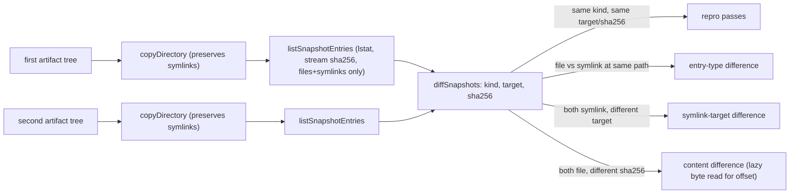

# Compare symlinks in repro checks — /work catches what /review can't

## What we set out to do

`desktop check --repro` compared two artifact trees by relative path and file bytes after a symlink-flattening copy, so a build emitting a symlink could pass repro against a build emitting a regular file at the same path with the same eventual bytes — a silent install-divergence vector. Issue #503 closed that gap by making the snapshot walk preserve filesystem entry type and symlink target, with a discriminated `SnapshotEntry` union driving an entry-aware diff.

## What actually ended up working

`/architect` proposed a three-kind discriminated union: `file | symlink | directory`. `/review` pressure-tested the design — checked Node API existence (`lstat`, `readlink`, `symlink`), grep-verified that no test fixture used empty resource fields, audited memory cost and cross-platform behavior — and locked the three-kind shape with a memory-cost edit (drop `content` from `SnapshotEntry`, stream sha256, lazily read bytes only on drift). Implementation matched the locked architecture exactly. **The first test run on the actual codebase surfaced a problem neither pass caught:** emitting `kind: "directory"` entries produced phantom `missing-in-first` diffs on empty subdirectories that one build pass left behind from intermediate state. The fix landed in-cycle, before any commit hit CI: narrow `SnapshotEntry` and `ReproEntryKind` to `file | symlink` only, and have the walk recurse into directories without emitting them as entries.

The shipped two-kind design still catches the issue's primary concern (symlink↔file drift at leaf positions) and secondary concern (symlink-target drift). It does not catch empty-directory presence drift — but the issue scope was symlink-vs-file, not empty-directory tracking, and empty directories were the _source_ of the false positives.

## What surfaced in review

Zero inline review threads from external reviewers. `/code-review`'s posted summary noted the in-cycle architecture revision as a transparency point. No pushbacks, no escalations.

## First-principles postmortem

The invariant that mattered: the gate fails iff two passes produce different artifact shape (entry type, symlink target, file bytes) for any leaf position. The assumption that changed: _empty intermediate directories left by a build pipeline are part of "the artifact tree."_ They aren't — they're noise from build steps that don't fully clean up. Once that distinction was named, the right scope was clear: _leaf entries only_ (files + symlinks), with directories as containers that the walk recurses into without emitting.

## Game-theory postmortem

`/architect` and `/review` both pressure-test the design from prose. They cite `file:line`, grep-verify claims, audit blast radius, and run principle-compliance checks. Both correctly judged the three-kind design as internally coherent. But they reason about _abstract artifact trees_, not the _actual transient state_ a real test fixture has on disk between passes. `/work` caught the gap because `/work` runs the locked design against the actual codebase's actual test fixtures. The mechanism that aligned the cycle: the workflow's three-stage proof obligation (`/architect` derives, `/review` pressure-tests the derivation, `/work` verifies first contact with real data). Each stage catches a different class of error. Bad equilibrium avoided: shipping a three-kind design that produces false-positive repro failures whenever a build pipeline leaves an empty directory behind — future maintainers would have hand-tuned around those failures with allow-lists or directory-content checks, eroding the gate's meaning.

## Non-obvious lesson

`/architect` and `/review` check that the design is _internally consistent_; `/work`'s first test run checks that the design is _consistent with real-world data_. These are different tests. A clean `/architect`+`/review` lock guarantees the prose is coherent, not that the first commit will pass. When the architecture introduces a new discriminated union (or any classifier) over runtime data, the test fixtures may contain instances the architecture's mental model doesn't account for. Those instances are not pathological — they're real-world data the abstraction has to handle. Plan for at least one in-cycle architectural adjustment per PR that introduces a new entry/event/state classifier; the cheapest place to catch it is `/work`'s first test run, before any commit lands.

## Reproducible pattern

When `/architect` introduces a new discriminated union over runtime data:

1. Expect `/work`'s first test run to fail in a way the prose pass didn't predict.
2. Treat the failure as evidence about real-world data shape, not as a bug in the test or a flaw in the implementation.
3. Either (a) add a variant to the union (e.g. add `directory` and handle the empty case correctly), or (b) narrow the union and document why the dropped variant isn't part of the issue's scope.
4. Update the architecture's prose, mermaid, and module table in-cycle. Don't ship a design whose text disagrees with the code.

## AGENTS.md amendment candidate

When `/architect` introduces a new discriminated union over runtime data (filesystem entries, event payloads, lifecycle states), expect `/work`'s first test run to surface real-world instances the prose pass didn't anticipate, and revise the union or its scope in-cycle. Why: prose-only review (`/architect`+`/review`) checks internal coherence; only running the design against real test fixtures verifies coherence with actual data shape.

This is a proposal. Review and edit AGENTS.md yourself if you want to adopt it — `/learn` never auto-edits AGENTS.md.
