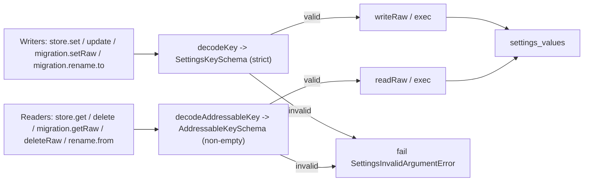

# Reject control bytes in Settings keys — validator split for legacy drain

## What we set out to do

`SettingsStore` accepted any non-empty string as a key and persisted it to
SQLite, so durable rows, change events, and migration logs could carry NUL or
other control bytes that operators could not display, compare, or export
safely. Issue #600 closed that invariant gap: every accepted settings key
must be a non-empty, control-byte-free identifier, enforced at one
boundary (`decodeKey`) shared by the public store and the migration
context. Out of scope: defining a hierarchical key grammar, schema/DB
changes, and migrating existing databases that already contained
NUL-bearing keys.

## What actually ended up working

The locked architecture was a single validator boundary: `decodeKey` would
decode against a new `SettingsKeySchema = NonEmptyString.check(isPattern(/^[^\x00-\x1F\x7F]*$/))`,
and every writer — public (`set`/`update`) and migration
(`getRaw`/`setRaw`/`deleteRaw`/`rename`) — would route through it.
The shipped design splits the validator into two:

- **`SettingsKeySchema`** (strict) for _writes_: `Settings.set`,
  `Settings.update` target write, `Settings.migration.setRaw`,
  `Settings.migration.rename.to`.
- **`AddressableKeySchema = NonEmptyString`** (lenient) for _reads and
  deletes_: `Settings.get`, `Settings.delete`, `Settings.migration.getRaw`,
  `Settings.migration.deleteRaw`, `Settings.migration.rename.from`.

`keys()` is documented as deliberately unvalidated so legacy rows remain
enumerable for drainage.

## What surfaced in review

Four review threads (all unresolved at review time): one P1 from the
ChatGPT Codex bot on `settings.ts:651`, one major and two minors from the
parallel `/code-review` six-reviewer fan-out. All four addressed, zero
pushbacks, zero escalations. The Codex P1 and `/code-review`'s major
landed on the same finding from independent paths — a strong signal the
issue was real, not a stylistic disagreement. The two minors covered
docstring/cross-reference of `SettingsKeySchema` and the implicit
transactional rollback dependency in `runFailingMigration`. One security
finding (telemetry span attribute capturing pre-validation key bytes)
fell below the 0.70 confidence threshold and was withheld; deferring it
to a follow-up issue if the leak is ever observed in operator pastes.

## First-principles postmortem

The invariant that mattered most: every key written to `settings_values`
must be a non-empty, control-byte-free identifier. The assumption that
changed: "single validator at one boundary" implicitly assumed every
caller of that boundary had identical needs. They did not. There were
two distinct invariants the original architecture collapsed into one —
_what is a valid durable key for new writes_ (strict) and _what is an
addressable existing row_ (lenient enough to reach legacy state). The
source of truth for the _new_ rule lives in `SettingsKeySchema`; the
source of truth for _addressability_ is the SQLite primary key on
`(namespace, key)`. Treating them as the same primitive made the
runtime actively reject pre-rule rows, breaking
`secrets-migration.ts` (which iterates `settings.keys()` and then
`get`/`delete`s each entry) on every launch for any installation that
ever persisted a NUL-bearing key.

## Game-theory postmortem

The architecture's intended equilibrium — every write goes through one
validator, no writer can drift — was achieved. The bad equilibrium I
missed during `/architect` and `/review`: an operator whose database
contained a legacy NUL row had no in-app escape valve. Their incentive
became "edit SQLite by hand" or "wipe settings" — the exact brittle
local fix the centralized Settings contract is meant to prevent. The
mechanism that aligned behavior was the parallel review fan-out: Codex
flagged the consumer impact concretely (with file:line evidence), and
the `previous-findings` reviewer cross-referenced
`docs/learnings/2026-05-05-path-normalization-symlink-policy.md`'s split
between _requested authority_ and _resolved identity_ — the same shape.
The information missing early was the consumer survey — at
`/architect` time, neither I nor the reviewer agents enumerated which
in-tree consumers iterate `Settings.keys()`. Future architecture
reviews on validation tightening should include that survey before
locking.

## Non-obvious lesson

"Out of scope: build a backfill migration" and "the runtime actively
rejects this state on every read" are not the same statement. A
hardening PR that tightens a writer invariant must explicitly reason
through the read/delete API's behavior on rows that pre-date the new
rule. A validator that retroactively bricks durable state turns a
hardening into a regression — and the consumer that bricks first is
usually the migration code that was supposed to clean things up.

## Reproducible pattern

Validator split for state-touching APIs that tighten durable invariants:

1. **Writers** (`set`, `update`, `insert`, target side of `rename`):
   strict — enforce the _new_ rule. New writes can only produce
   compliant rows.
2. **Readers and deleters** (`get`, `delete`, source side of `rename`,
   raw migration helpers): lenient enough to reach pre-rule rows.
   Cleanup paths must remain reachable.
3. **Listing** (`keys`/`scan`): unvalidated, with a code comment
   explaining the asymmetry so the next maintainer does not "fix" it.

## AGENTS.md amendment candidate

When tightening a validator that gates durable state, split it into a
**strict writer schema** and a **lenient addressable schema**. Why:
a runtime that rejects legacy state on read has no in-app escape valve
for operators or in-tree migration code, and turns a hardening into
a regression. How to apply: writes enforce the new rule; reads, deletes,
and listing remain addressable for pre-rule rows.

This is a proposal. Review and edit AGENTS.md yourself if you want to
adopt it — `/learn` never auto-edits AGENTS.md.
