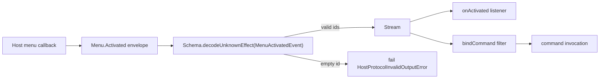

# Validate menu activation event identifiers — pin the positive half of optional schemas

## What we set out to do

The `Menu.Activated` event payload schema accepted empty `itemId`/`commandId`/`windowId` strings, so app listeners and `bindCommand` filters had to defensively re-check fields the schema's name implied were already meaningful. Issue #500 closed that gap: tighten `MenuActivatedEvent` so `itemId` and `commandId` are non-empty and `windowId` is non-empty when present.

## What actually ended up working

The locked architecture proposed swapping three fields: `Schema.String → Schema.NonEmptyString` for the required IDs, and `Schema.optionalKey(Schema.String) → Schema.optionalKey(Schema.NonEmptyString)` for `windowId`. The bridge event-decode pipeline at `client.ts:441-453` automatically maps the resulting Schema parse failure to `HostProtocolInvalidOutputError("InvalidOutput")`, so no client-wiring change was needed. The implementation matched the architecture 1:1; the API snapshot was refreshed in the same PR.

`/code-review` then caught one coverage gap: the architecture preserved the _optional_ half of `windowId` (i.e., the field can be absent), but no test pinned that path. The new parametric test only exercised rejection cases (empty itemId, empty commandId, empty present windowId). An absent-windowId regression test was added in `/address` to assert the optional contract holds end-to-end.

## What surfaced in review

Zero inline review threads, one summary-only self-finding (verdict Address), zero pushbacks, zero escalations. The finding was that the architecture preserved `windowId` as `optionalKey` but no test exercised the absent path; resolved in commit `b4cb26e`.

## First-principles postmortem

The invariant that mattered: every decoded `Menu.Activated` event carries non-empty routing keys, but the optional `windowId` field stays optional. The assumption that survived: tightening one half of an optional schema (rejecting empty when present) does not by itself imply the other half (accepting absent) is exercised. The architecture's prose said both halves matter; the test set only proved the rejection half.

## Game-theory postmortem

Players: architect (me), reviewer (me), code-reviewer (me). The same information asymmetry observed in #498 surfaced again here, in a slightly different shape: when /architect says "X is optional / X is the special case," reviewing the prose does not produce evidence that a test exists for the optional-or-special path. /code-review's diff-grounded discipline closes the gap because it can grep for tests by name and shape. Bad equilibrium avoided: optional-schema or sentinel-value behavior surviving only in architectural intent and getting silently dropped by a future refactor.

## Non-obvious lesson

The #498 learning said "grep for existing tests before claiming they stay green." This cycle (and PR #702 before it) shows an adjacent pattern: when the architecture _preserves_ a special-case behavior — `Schema.optionalKey` accepting absent, `timeoutMs: 0` being the non-cancellable sentinel, an empty array being the empty-template fast path — the test set must include a positive test for that behavior. Rejection tests alone do not pin a preserved invariant. Two cycles in a row have caught this; the rule is now stable enough to formalize.

## Reproducible pattern

When the architecture says any of the following, the test set must include a positive test for the preserved behavior, not just the rejection paths:

1. "X is optional" — add a test where X is absent and the result still decodes successfully.
2. "X is the sentinel for case Y" — add a test where X equals the sentinel value and Y holds.
3. "Existing tests for X stay green" — grep for X (still required from #498).
4. "Out of scope, separately tracked" — confirm a separate issue exists (still required from #498).

Locking the architecture without these tests means the preserved-behavior contract lives only in prose, and a future refactor that touches the schema or the runtime path can quietly weaken it.

## AGENTS.md amendment candidate

Extend the #498 grounding rule: when the architecture preserves an optional, sentinel, or special-case behavior, the test set must include a positive test that exercises that behavior — not just the rejection or failure cases. Why: rejection tests prove the new rule fires; positive tests prove the preserved behavior still works. Both are required to lock the contract.

This is a proposal. Review and edit AGENTS.md yourself if you want to adopt it — `/learn` never auto-edits AGENTS.md.
