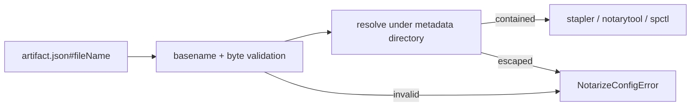

# Contain notarization artifact file names to their metadata directory

## What we set out to do

Issue #819 closed a notarization trust-boundary bug: `artifact.json#fileName` could contain `../outside.dmg`, and `bun desktop notarize` would pass the sibling file to `stapler`, `notarytool`, and `spctl`. The intended architecture was to treat package metadata as descriptive, not authoritative, by validating a contained basename before any external Apple command ran.

## What actually ended up working

The final fix keeps the boundary inside `readPackagedArtifacts`, where notarization already converts package metadata into command inputs. `resolveArtifactPath` rejects path separators, URL/drive separators, and control bytes, resolves the candidate under the metadata directory, and checks that the resolved parent is still that directory before `statPath` or command execution. The regression uses an injected command runner and asserts zero command calls for traversal, POSIX nested paths, Windows nested paths, URL-shaped names, and control bytes. A second regression preserves package-produced basenames with consecutive dots.

## What surfaced in review

Two review comments changed the branch. The first caught a POSIX-only assertion that failed on Windows because the error contained backslashes. The fix asserted stable facts separately: the metadata directory name and `artifact.json#fileName`. The second caught an overbroad `fileName.includes("..")` rejection. Package artifact names preserve dots, so `My..App.dmg` can be a legitimate contained basename. Removing that substring ban kept the security property on path segments while avoiding a false-negative regression.

## First-principles postmortem

The invariant was not "the string must not contain two dots." The invariant was "metadata cannot cause notarization to operate outside the metadata directory." Path traversal is a relationship between a candidate path and its root, not a substring. Once the code enforced separators plus resolved parent containment, a dotted basename stopped being dangerous. The source of truth became the package writer's actual filename contract: metadata stores `basename(artifactPath)`, and `safeArtifactName` preserves dots.

## Game-theory postmortem

The local incentive was to encode the issue text literally and reject `..` anywhere because it looked safer and cheaper to review. That move pushes cost to users with valid package-produced artifact names and to future engineers debugging why package output cannot be notarized. The better mechanism is to test both sides of the boundary: malicious path-shaped metadata must fail before commands, and self-produced contained metadata must still pass. Review aligned the incentives by comparing the consumer guard against the producer contract.

## Non-obvious lesson

A security guard should encode the dangerous operation, not a scary substring. `..` is dangerous as a path segment or when combined with a separator; it is not dangerous inside a contained basename. Boundary tests need one attacker fixture and one producer-compatible fixture, otherwise a fail-closed patch can silently reject valid artifacts from the same system.

## Reproducible pattern

When hardening metadata-to-path code:

1. Identify the producer contract for valid metadata.
2. Reject syntax that creates path structure at the consumer boundary.
3. Resolve the candidate and check containment against the trusted root.
4. Add one malicious fixture and one valid producer-shaped fixture.

## AGENTS.md amendment candidate

For path containment fixes, tests must cover both rejected traversal-shaped input and accepted producer-shaped input. Why: substring-only hardening can create fail-closed regressions against artifacts the repo itself generates.

This is a proposal. Review and edit AGENTS.md yourself if you want to adopt it — `/learn` never auto-edits AGENTS.md.
