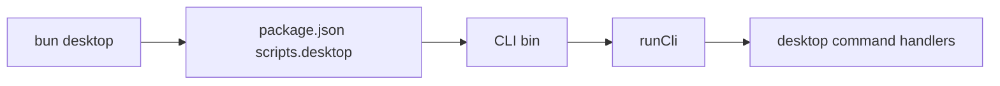

# Expose the documented bun desktop entrypoint

## What we set out to do

Issue #770 found that the spec and docs promised `bun desktop ...`, but the repo root had neither a `desktop` script nor an installed bin path. The CLI implementation existed, but the public command failed before CLI startup with Bun's `Script not found "desktop"` error.

## What actually ended up working

The smallest working shape was to expose `desktop` at each project boundary instead of changing the CLI internals. The repo root script delegates to the checked-in CLI bin source, while the React template declares both a `desktop` script and an explicit `@effect-desktop/cli` dependency so generated manifests carry the installed-bin shape. A repo-shape smoke now launches `bun desktop` and verifies the failure is not Bun command resolution.

## What surfaced in review

One review comment was addressed. The architecture artifact initially described the template script as delegating through `bunx --bun @effect-desktop/cli`, but the committed manifest uses `"desktop": "desktop"` plus an explicit CLI dependency. The fix aligned the durable architecture note with the actual installed-bin mechanism.

## First-principles postmortem

The invariant was command honesty: the command documented for users must be executable from a normal project root. The primitive distinction that mattered was "CLI implementation exists" versus "project command resolves." A package-local `bin` entry proves the package can expose an executable after installation; it does not prove the current project root has a command named `desktop`.

## Game-theory postmortem

Maintainers are naturally tempted to test the shortest internal path, especially `bun packages/cli/src/bin.ts`, because it is direct and avoids package-manager behavior. That local shortcut lets CI prove command behavior after startup while hiding failures in command discovery. The corrective mechanism is a promise-level smoke: run the command string users see, then keep detailed CLI tests on the deeper `runCli` seam.

## Non-obvious lesson

A CLI package bin is not a project entrypoint until a project manifest or install step makes it discoverable. For command-line SDKs, tests need one boundary-level smoke for the advertised command even when the command implementation has thorough unit coverage.

## Reproducible pattern (if any)

When docs promise `tool subcommand`, add one cheap smoke that invokes exactly `tool`.
Keep behavior tests on the deep function or pipeline that owns semantics.
Assert template/package manifests carry the same command shape users receive.

## AGENTS.md amendment candidate (if any)

For public CLI commands, add one test that invokes the documented command string from the project root. Why: direct source-path tests prove implementation behavior but not command discoverability.

This is a proposal. Review and edit AGENTS.md yourself if you want to adopt it — `/learn` never auto-edits AGENTS.md.
