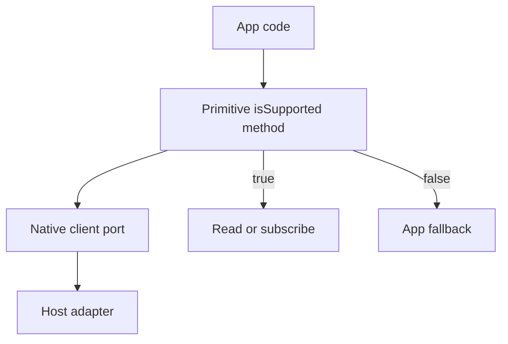

# Expose guards for partial OS-state primitives

## What we set out to do

Issue #850 required read-only OS-state primitives to expose support guards for
Appendix K rows that are partial or unsupported. The core invariant was that app
code must be able to ask whether `Screen.getPointerPoint`,
`PowerMonitor.onPowerSourceChanged`, `SystemAppearance.getAppearance`,
`SystemAppearance.onAppearanceChanged`, and `SystemAppearance.getAccentColor`
are usable before relying on those calls or streams.

## What actually ended up working

The shipped shape followed the existing Dock guard pattern instead of inventing a
new capability abstraction. Each primitive now owns a method literal schema, an
`IsSupportedInput`, and a `{ supported: boolean }` result wrapper. The native
client port returns the wrapper, while the public service maps it to a boolean.

The event-only `PowerMonitor` service was the useful forcing function. It proved
that the API contract can expose request methods and event streams side by side
without changing existing stream call sites.

## What surfaced in review

The code-review pass found no code findings. CI surfaced one real correction:
the API snapshot had platform-sensitive signature wrapping for two interface
methods. Updating the snapshot to the macOS-wrapped form kept both local and CI
API checks green.

## First-principles postmortem

The important primitive was not "read OS state"; it was "discover support before
using OS state." Without that distinction, fallback reads and stream failures
look acceptable because they eventually tell the app something. They are not
equivalent: discovery after use is too late for production checks and too late
for app fallback design.

The implementation stayed small because the support fact is just data at the SDK
boundary. No lifecycle state, subscription handshake, or platform detector
belongs in the TypeScript service until the host adapter owns a real platform
fact.

## Game-theory postmortem

The bad local move is to make the operation itself answer support by failing or
returning a default value. That keeps the first implementation cheap but makes
compliant app authors pay the cost: they cannot guard without performing the
operation. A cheap `isSupported(method)` call changes the payoff. The correct
move becomes the shortest app path, and production checks get a stable
expression to recognize.

## Non-obvious lesson

Event-only services may still need request methods when the request answers a
different question than the stream. Keeping `PowerMonitor.isSupported` as a
normal request method did not complect state with event delivery; it separated
capability discovery from subscription.

## Reproducible pattern

For partial native primitives:

1. Put the operation literal in the primitive contract file.
2. Add `Primitive.isSupported` with permission `"none"`.
3. Return a result wrapper at the client port and a boolean at the service.
4. Make unsupported clients return `false` without touching the guarded
   operation.

## AGENTS.md amendment candidate

For event-only native services, allow request methods when they answer
capability or metadata questions that must be known before subscription. Why:
forcing all knowledge through event streams hides support state until after use.
