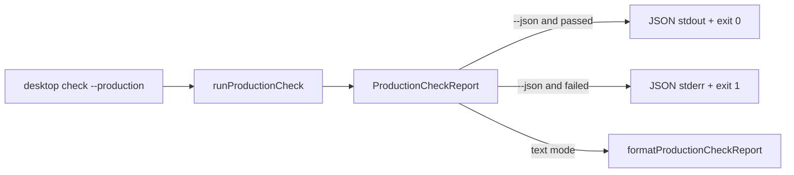

# Honor --json for production checks

## What we set out to do

`desktop check --production --json` was still printing the human production-security report. The goal was to keep production rule evaluation unchanged and fix only the CLI adapter so a completed `ProductionCheckReport` is emitted as JSON to stdout on pass and stderr on failure.

## What actually ended up working

The issue architecture held. `runProductionCheckCli` now waits until `runProductionCheck` returns its `ProductionCheckReport`, then applies output-mode routing at the CLI boundary. Human output still uses `formatProductionCheckReport(report)` when `--json` is absent, while JSON output serializes the existing report shape without adding a second report model.

## What surfaced in review

The review round produced no findings. Address triage also found no unresolved review threads, issue comments, or line comments. The only friction was procedural: each workflow-note commit creates a new PR head, so CI must be watched again after documentation-only commits instead of relying on the prior green code head.

## First-principles postmortem

The important invariant was that production-check semantics and CLI output formatting are separate concepts. A production check answers whether the app passes the release security gate; `--json` decides how that answer crosses the process boundary. Keeping that split made the fix small and avoided duplicating rule aggregation or changing security behavior to satisfy an automation contract.

## Game-theory postmortem

CI callers need structured output because prose creates a brittle string-parsing incentive. If one command ignores the global `--json` flag, every downstream script must either special-case that command or parse human text. Routing reports through a single adapter branch makes the good local move cheaper: command authors can preserve domain logic and still satisfy automation consumers at the boundary.

## Non-obvious lesson

For CLI output bugs, the regression test should prove the whole contract, not just the string format. The useful assertion here combined exit code, output stream, parseable JSON, report shape, and absence of the old human marker. That bundle catches adapter regressions that a snapshot of stdout alone would miss.

## Reproducible pattern (if any)

When a global output flag is ignored:

1. Let the domain function return its normal typed report.
2. Branch on the flag at the CLI adapter boundary.
3. Assert exit code, stdout/stderr routing, parseability, and representative fields.
4. Assert the old human marker is absent from JSON output.

## AGENTS.md amendment candidate (if any)

For CLI output-format fixes, tests must assert stream routing, exit code, parseable structured output, and absence of the prior human marker. Why: global flags are process-boundary contracts, and stdout-only snapshots miss broken automation semantics.

This is a proposal. Review and edit AGENTS.md yourself if you want to adopt it — `/learn` never auto-edits AGENTS.md.
