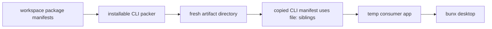

# Make the CLI package install outside the workspace

## What we set out to do

The CLI package needed to install from outside the monorepo without leaking `workspace:*` dependencies to a consumer app. The intended architecture was a publish or pack boundary that keeps the source manifest workspace-native, rewrites first-party dependencies for the installable artifact, and proves the result by installing it in a temp app and invoking the `desktop` bin.

## What actually ended up working

The working shape was an explicit artifact packer instead of a checked-in manifest change. Changing the source CLI manifest to sibling `file:` dependencies made Bun 1.3.13 treat the frozen lockfile as dirty on every install, so the repo manifest stayed linked with `workspace:*`. The packer copies `bridge`, `config`, and `cli` into a fresh artifact directory, rewrites only the copied CLI manifest to sibling `file:` specs, installs production dependencies inside the copied packages, and the smoke test installs that copied CLI from a temp app before running `bunx desktop`.

## What surfaced in review

One review thread was addressed. The initial packer recursively removed the caller-provided output path before writing the artifact. That made a convenience script capable of deleting the repo if invoked with `.`. The fix removed script-owned cleanup entirely: the packer now creates the destination and fails if it already exists.

## First-principles postmortem

The invariant was not just "the artifact installs"; it was "the artifact boundary cannot make the repo less safe to operate." An installable artifact is disposable, but the path supplied by a human is not. The better primitive is a fresh output directory. Freshness gives the script a clean write surface without asking it to decide which existing files are safe to delete.

## Game-theory postmortem

The local incentive was to make the packer idempotent by deleting whatever destination the caller passed. That optimizes repeated local runs but creates a high-loss failure mode for a typo. Requiring a fresh destination changes the mechanism: cleanup stays with the caller, where intent is explicit, and the script has one job. The bad equilibrium avoided is normalizing broad recursive deletion in build tooling because it makes tests convenient.

## Non-obvious lesson

Artifact-producing scripts should not recursively clean caller-provided paths. A packer can require a fresh directory and still be easy to use; destructive cleanup is a separate operation with a separate risk profile.

## Reproducible pattern (if any)

When a build tool writes an artifact, prefer `mkdir(destination)` over `rm -rf destination && mkdir destination`.
If repeatability needs cleanup, make the caller choose the cleanup path explicitly.
Add the external consumer smoke at the artifact boundary, not only at the source manifest.

## AGENTS.md amendment candidate (if any)

Build or packaging scripts must not recursively delete caller-provided paths; require a fresh output directory or a repo-owned temp directory instead. Why: typo-resistant tooling matters more than idempotent local convenience.

This is a proposal. Review and edit AGENTS.md yourself if you want to adopt it — `/learn` never auto-edits AGENTS.md.
