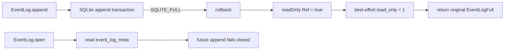

# Persist EventLog read-only state after disk-full failures

## What we set out to do

The issue asked for `EventLog.append` to make the existing read-only metadata durable when SQLite reports `SQLITE_FULL`. The in-memory latch already stopped writes in the current process, and `append` already denied writes when `event_log_meta.read_only = 1`; the missing transition was persisting that bit before returning `EventLogFull`.

## What actually ended up working

The shipped shape stayed close to the locked architecture. After the append transaction maps a SQLite full condition to `EventLogFull`, EventLog sets the in-memory `readOnly` `Ref`, then attempts `UPDATE event_log_meta SET read_only = 1 WHERE namespace = ?` on the same serialized connection. That update happens after the failed append transaction rolls back, so it can commit independently. The public append contract does not widen: callers still get the original `EventLogFull`, while reopen now observes durable metadata and denies future appends.

## What surfaced in review

Review produced one major finding and no pushbacks. The first implementation suppressed metadata-update failure to preserve the original append error, but it did so silently. Addressing the comment kept the original failure while adding an `Effect.logWarning` breadcrumb with namespace, failure tag, and operation, plus a regression that simulates the metadata latch update failing after the original event insert reports `SQLITE_FULL`.

## First-principles postmortem

The invariant was not only "do not append after disk-full"; it was "the failed transition to read-only must be observable if it cannot be made durable." Preserving the original append failure is correct because that is the user-visible operation, but the metadata write is the recovery-state transition. If that transition fails, hiding it removes the evidence needed to understand why a later restart may retry writes.

## Game-theory postmortem

The local incentive was to treat best-effort cleanup as disposable because it should not replace the primary error. That creates a bad incident equilibrium: the code looks correct in tests, but operators lose the signal that the durable latch was not recorded. The better mechanism is "preserve primary failure, log secondary failure," which keeps caller semantics stable while making the operational gap visible.

## Non-obvious lesson

Best-effort state transitions still need observability. When the main operation has already failed, suppressing a secondary failure can be correct for API semantics, but it is not correct for incident response unless the secondary failure is logged or otherwise observable.

## Reproducible pattern (if any)

For fail-closed recovery transitions:

1. Return the original operation failure to callers.
2. Attempt the durable transition outside any rolled-back transaction.
3. Log any transition failure before suppressing it.
4. Test both the durable success path and the "transition failed but original error survived" path.

## AGENTS.md amendment candidate (if any)

For best-effort recovery writes, preserve the primary error but log the suppressed recovery-write failure. Why: API semantics and incident observability are separate invariants.

This is a proposal. Review and edit AGENTS.md yourself if you want to adopt it — `/learn` never auto-edits AGENTS.md.
