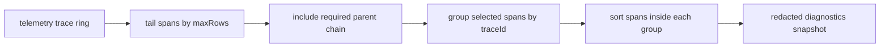

# Preserve trace integrity in diagnostics row caps

## What we set out to do

Issue #876 asked for `DiagnosticsPanels` to stop returning structurally false trace groups under `maxRows`. The failing projection sliced raw telemetry spans before grouping, so a child span could be returned with `parentSpanId: Some("root")` while the root span had already been dropped. Logs and metrics still needed their independent row caps, and telemetry recording, trace IDs, redaction, frame intervals, and the raw telemetry ring API were out of scope.

## What actually ended up working

The first implementation grouped the whole trace ring and then capped groups. That fixed the orphaned-parent repro but made diagnostics work scale with the full trace ring and changed cap recency to first-seen trace order. Review pushed the design to the compatible parent-chain option from the issue: keep the raw capped tail as the source of recent activity, scan backward only for required parents, and group the selected spans.

This preserves trace integrity without adding truncation metadata or grouping and sorting every retained span on each diagnostics frame.

## What surfaced in review

Two review comments were addressed and resolved. The first caught that grouping the full trace ring on every `observe()` frame made work scale with `traceRingSize` rather than the panel cap. The second caught that capping grouped traces by insertion order could drop the most recently active trace when an older trace received a later child span. Both comments changed the shipped design and added the recency regression test.

## First-principles postmortem

The invariant was not "return at most N trace spans"; it was "do not return a false causal graph." A parent edge is a claim, and a diagnostics projection that drops the parent while keeping the edge has invented a graph that telemetry did not record. The assumption that changed was that grouping first is always the honest fix. It is honest about structure, but it ignores the other primitive fact: a live panel's retention knob is also a work budget.

## Game-theory postmortem

The local incentive was to fix the visible bug by moving `slice` after grouping because that is a one-line change and matches the issue's "complete trace groups" option. The global cost is paid by anyone running devtools under high trace volume: a cheap-looking projection becomes a per-frame full-ring grouping and sorting loop. Review aligned the incentives by forcing the code to satisfy both promises at once: preserve causal truth and keep the display cap as the work boundary.

## Non-obvious lesson

Observability caps are not just display limits; they are also performance contracts. When a projected row contains references to other rows, the cap must be applied to the user's recency window and then expanded only by the minimum dependency closure needed to make returned rows truthful.

## Reproducible pattern (if any)

For diagnostic projections with graph edges:

1. Select the bounded recent window first.
2. Add the required dependency closure for returned rows.
3. Group and sort only the selected rows.
4. Test both structural integrity and recency semantics.

## AGENTS.md amendment candidate (if any)

When capping diagnostic graph data, cap the recent display window first and then add only required referenced rows; Why: grouping the whole source fixes truthfulness by spending unbounded per-frame work.

This is a proposal. Review and edit AGENTS.md yourself if you want to adopt it — `/learn` never auto-edits AGENTS.md.
