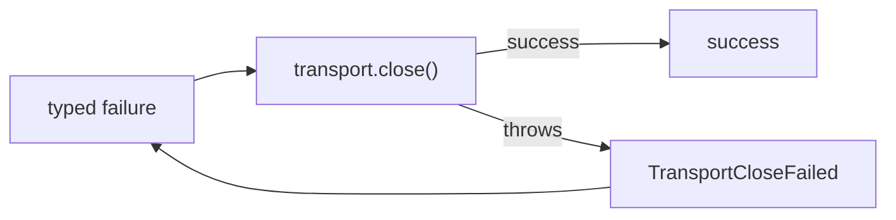

# Report transport close failures

## What we set out to do

The issue asked for `TransportConnection.close` to stop converting adapter close failures into success. The concrete failure was at the runtime transport boundary: a framed transport could throw while releasing its stream or iterator, but callers received `Effect<void, never, never>` and had no typed signal, log, or diagnostic.

## What actually ended up working

The cleanest fix was to make close fallible at the same boundary where send and receive are already fallible. `TransportConnection.close` now returns `Effect<void, TransportError, never>`, and adapter close exceptions map to a dedicated `TransportCloseFailed` tag with the `<operation>.close` operation name. The in-memory queued connection still closes successfully, and the public API snapshot records the intentional signature change.

## What surfaced in review

Code review produced no findings. CI caught the important release artifact: the public core API snapshot had to be updated because the close signature and transport error union changed. After regenerating the snapshot, the replacement CI run passed on ubuntu, Windows, and macOS.

## First-principles postmortem

The invariant was "cleanup outcome is observable." Close is not a pure finalizer; it releases external I/O state. Once stated that way, an infallible type was false information. The key assumption that changed was that cleanup convenience should dominate caller ergonomics. In production-critical code, a cleanup boundary that can throw must either return a typed error or emit a durable diagnostic.

## Game-theory postmortem

The local incentive was to make `close()` easy for every caller by assigning it `never` in the error channel. That makes the happy path pleasant but creates a bad equilibrium: every future adapter can fail cleanup and the runtime still appears healthy. The new mechanism shifts the cost to the right place. Adapter failures become values at the connection boundary, and test authors can assert the failure without building telemetry scaffolding.

## Non-obvious lesson

An infallible cleanup type is a claim about the world, not just a convenience for callers. If the cleanup action crosses an I/O boundary, the type must either expose failure or the module must create an explicit diagnostic before suppressing it.

## Reproducible pattern (if any)

For cleanup APIs around external resources:

1. Model close/release as fallible when the adapter can throw.
2. Use a close-specific error tag instead of reusing send/write failures.
3. Preserve operation names at the close boundary.
4. Add a fake adapter test that throws during cleanup.
5. Update API snapshots when the public lifecycle contract changes.

## AGENTS.md amendment candidate (if any)

For external-resource cleanup APIs, do not make the error channel `never` unless the adapter cannot fail or a diagnostic is emitted before suppression. Why: infallible cleanup types hide incident-relevant release failures.

This is a proposal. Review and edit AGENTS.md yourself if you want to adopt it — `/learn` never auto-edits AGENTS.md.
