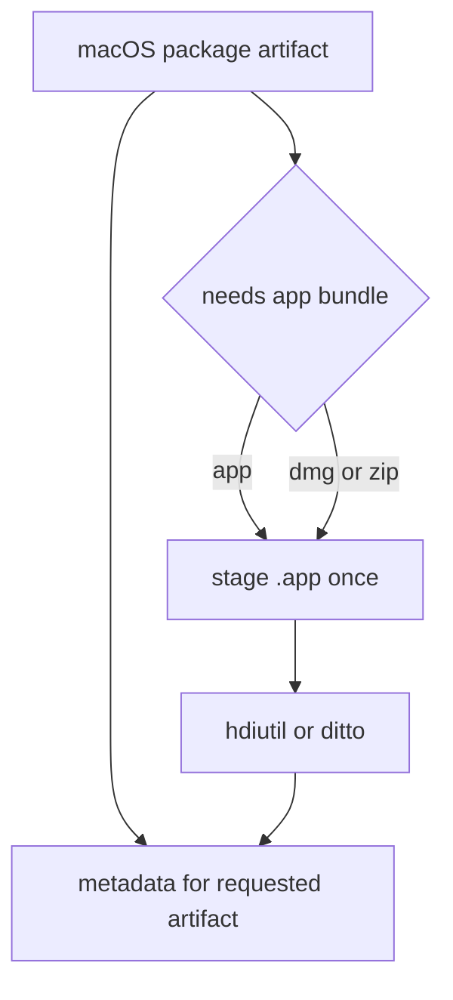

# Stage macOS app bundle for dmg and zip packaging

## What we set out to do

Issue #877 asked the package pipeline to stop treating the macOS `.app` bundle as a stale external prerequisite for `--artifact dmg` and `--artifact zip`. A clean single-artifact package run needed to stage the app bundle from the current validated build layout before invoking `hdiutil` or `ditto`.

## What actually ended up working

The final shape kept the dependency inside `packages/cli/src/package-pipeline.ts`. `runDesktopPackage` now carries package-run production state, `produceArtifact` can return more than one step for one requested artifact, and `ensureMacosAppBundle` stages the app bundle once through the existing `produceMacosApp` path. Default macOS packaging still emits requested `app`, `dmg`, and `zip` metadata normally, while explicit `dmg` and `zip` runs record the prerequisite `macos-app` step without writing unrequested app metadata.

## What surfaced in review

The local `/code-review` pass produced no code findings. `/address` found no unresolved review threads; the only PR-level comment was an informational Codex usage-limit notice and did not change the design.

## First-principles postmortem

The invariant is that a packaging command must be closed over the build layout it validated. A wrapper artifact is not independent just because it has a separate CLI selector; its real input is a staged app bundle. Once the package run deletes the output directory, any secondary artifact producer that does not stage its own source is depending on an impossible precondition in clean environments.

## Game-theory postmortem

The bad local move was one producer per requested artifact. That model made the code easy to read and let the default all-artifact path pass, but it hid dependency ordering from single-artifact callers and reviewers. The corrective mechanism was to make prerequisite staging part of the producer contract, so future secondary artifacts have to either return their setup steps or fail loudly instead of inheriting stale output.

## Non-obvious lesson

Artifact selection is not the same as artifact dependency. A CLI flag can select one deliverable while the implementation still needs to produce internal prerequisites in the same run. Tests should assert the prerequisite step and source path, not only the final wrapper file.

## Reproducible pattern (if any)

When an artifact wraps another local artifact, model the wrapped artifact as a package-run prerequisite.
Return every step that was required to produce the requested artifact.
Write metadata only for requested artifacts unless the product contract says otherwise.
Regression tests should start from an empty output directory and assert the platform tool's source path.

## AGENTS.md amendment candidate (if any)

Packaging tests for wrapper artifacts must assert prerequisite staging from an empty output directory. Why: a fake runner can make a wrapper file exist while hiding that its source artifact was never produced.

This is a proposal. Review and edit AGENTS.md yourself if you want to adopt it — `/learn` never auto-edits AGENTS.md.
