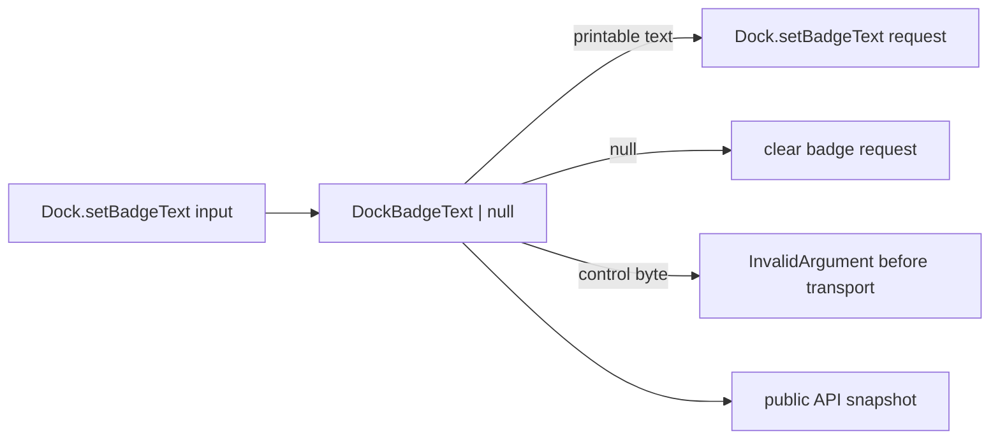

# Validate Dock.setBadgeText display strings

## What we set out to do

`Dock.setBadgeText` accepted arbitrary strings, including NUL and line breaks, and sent them to the host as successful bridge requests. The goal was to make badge text a bounded display-text contract: `null` clears the badge, printable strings display, and control-character strings fail as `InvalidArgument` before transport.

## What actually ended up working

The implementation added a private `DockBadgeText` schema in `packages/native/src/contracts/dock.ts` and used it directly in `DockSetBadgeTextInput`. The bridge test now proves `"1"` and `null` keep the host request shape, while NUL, newline, and tab text fail before the exchange records any request. The native API snapshot records the intentional exported schema signature change.

## What surfaced in review

`/code-review` found no issues. `/address` had no unresolved review threads or issue-level comments to process. CI stayed green after the PR metadata and review-record commits.

## First-principles postmortem

The primitive is not merely nullable string; it is nullable badge display text. `null` is the explicit control value for clearing the badge, so control bytes should not become a second implicit control channel. The compatibility decision was to preserve ordinary strings, including empty string, and only reject bytes the native UI contract cannot honestly treat as short display text.

## Game-theory postmortem

The local shortcut was to copy the stricter Dialog display-text schema and make badge text non-empty. That would make the implementation look consistent, but it would change behavior beyond the issue's invariant and create a bad equilibrium where each validation pass tightens contracts opportunistically. The better mechanism is to name the exact primitive and validate only the invariant it owns: badge text may be absent by `null`, but if present it must not contain control bytes.

## Non-obvious lesson

Nullable display strings need two separate decisions: what value means "clear" and what bytes are valid when a string is actually present. Reusing a stricter non-empty UI text schema can be wrong when the API already has a clear sentinel and the issue only proves control-character risk.

## Reproducible pattern (if any)

For native display-string inputs:

1. Identify whether the API already has a sentinel such as `null`.
2. Preserve the sentinel semantics in the schema.
3. Reject malformed display bytes before transport.
4. Add a bridge test proving valid sentinel, valid text, invalid text, and no-request-on-invalid behavior.
5. Run and commit the public API snapshot delta when the exported schema class changes.

## AGENTS.md amendment candidate (if any)

When validating nullable display strings, decide sentinel semantics separately from string-content validity; Why: copying a non-empty schema can accidentally change compatibility when `null` already models clearing.

This is a proposal. Review and edit AGENTS.md yourself if you want to adopt it — `/learn` never auto-edits AGENTS.md.
