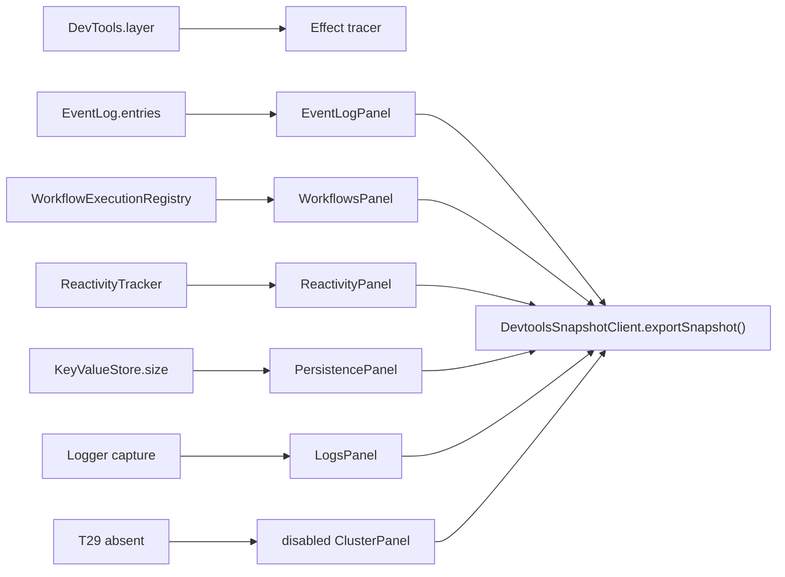

# Adopt effect/unstable/devtools and rebuild panels

## What we set out to do

Issue #1097 asked devtools to align with upstream Effect observability instead of growing bespoke runtime readers. The target was a `DevTools.layer` server adapter, panels backed by published streams or explicit companion registries, a headless `DevtoolsSnapshotClient.exportSnapshot()`, and a disabled cluster panel until T29 lands.

## What actually ended up working

The PR introduced the upstream devtools tracer layer and rebuilt the new panel surface around narrow services: event log entries, workflow execution records, reactivity invalidations, key-value store health, captured logs, and an explicit cluster-disabled snapshot. `DevtoolsSnapshotClient.exportSnapshot()` composes those panel snapshots into one CI-readable structure.

## What surfaced in review

Round 1 found two contract problems: `EventLogPanel` converted `EventJournalError` into defects with `orDie`, and workflow/reactivity panels required upstream runtime services they did not read. Round 2 found that `PersistencePanel` collapsed all `kv.size` causes into a silent unhealthy bit. Round 3 had no findings after event-log failures stayed typed, unused service requirements were removed, and persistence failures became explicit snapshot data without catching defects.

## First-principles postmortem

Devtools is an observability boundary. If that boundary turns infrastructure failures into defects or booleans with no cause, it stops explaining the system under pressure. Panel APIs can stay small, but they must either preserve expected failures in the Effect error channel or encode them as structured snapshot data.

## Game-theory postmortem

The local incentive was to make every panel expose `never` errors so snapshot export is easy to compose. That creates a bad equilibrium where adding a panel also erases the failure modes operators need most. The better mechanism is explicit per-panel contracts: expected read failures are either typed errors or visible health fields, while unused services are not required just to imply architectural alignment.

## Non-obvious lesson

A panel consuming a companion registry is honest only if its type says that. Requiring `WorkflowEngine` or `Reactivity` without reading those services makes the contract look more upstream-aligned while hiding the real source of truth.

## Reproducible pattern (if any)

For devtools panels, keep each panel's required services equal to the data it actually reads.
Do not use `orDie` to force observability reads into `never`.
If a health panel absorbs an expected failure, include a structured reason in the snapshot and do not catch defects.

## AGENTS.md amendment candidate (if any)

Devtools panels must not advertise unused runtime service requirements, and expected observability read failures must stay typed or become explicit snapshot fields. Why: observability code that hides its own failures produces false confidence during debugging.

This is a proposal. Review and edit AGENTS.md yourself if you want to adopt it — `/learn` never auto-edits AGENTS.md.
