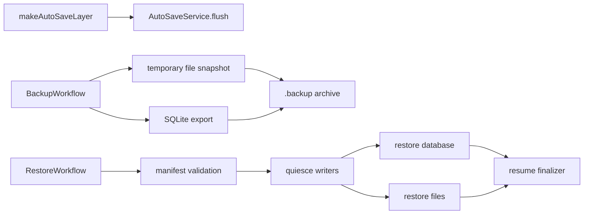

# Add auto-save and backup workflows for application data

## What we set out to do

Issue #1094 asked application data persistence to move into durable workflows: an auto-save cadence with idempotency, a backup workflow that snapshots user files and SQLite state into a `.backup` archive, and a restore workflow that validates the archive, quiesces writers, restores data, and rolls back cleanly after mid-flight failure.

## What actually ended up working

The PR added `AutoSaveWorkflow`, `BackupWorkflow`, and `RestoreWorkflow` under the core runtime workflow package. Issue #1202 later moved auto-save back to a plain Effect scoped layer because a local flush cadence has no durable state to resume. Backups now build a temporary snapshot, export SQLite bytes, write a manifest, copy the snapshot into the durable archive, and return only durable success data. Restore validates the manifest before touching data, stops writers before mutation, restores both files and database state, resumes writers in a finalizer, and rolls back both mutated surfaces on failure.

## What surfaced in review

Round 1 found that restore compensation only rolled back files and that writer resume lived on the success path. Round 2 found that backup labels were accepted as path segments, letting `../` escape the configured output directory. Round 3 found that the backup success payload returned `snapshotDir` even though the workflow deletes that temporary directory before succeeding.

## First-principles postmortem

Backup and restore workflows mutate durable user data. A correct rollback must cover every durable surface changed after the pre-restore snapshot: user files and the SQLite database. A correct quiesce operation must also be paired with a finalizer because a stopped writer is system state, not a local variable.

## Game-theory postmortem

The local incentive was to show each workflow activity compiling and to test the happy path. That can make partial failure look like an implementation detail even though restore is only trustworthy when the failure path preserves user data. The better mechanism is to test the exact damage boundary: fail after one durable surface changed, then assert every surface and writer state returned to the pre-restore state.

## Non-obvious lesson

Temporary paths should not appear in public workflow success payloads. Returning a deleted path makes cleanup observable as a broken API contract.

## Reproducible pattern (if any)

For restore workflows, snapshot every durable surface before mutation and test a failure after the first mutation succeeds.
Put quiesce resume in `Effect.ensuring` or an equivalent finalizer.
Treat user-supplied path labels as untrusted input; validate them as filename segments before joining paths.
Return durable artifacts from workflow success values, not scratch directories removed during cleanup.

## AGENTS.md amendment candidate (if any)

Backup and restore workflows should include a failure-after-first-mutation regression test that asserts every durable surface and writer gate returns to the pre-operation state. Why: restore correctness is defined by the failed path as much as the success path.

This is a proposal. Review and edit AGENTS.md yourself if you want to adopt it — `/learn` never auto-edits AGENTS.md.
