# Build durable crash report queue and submission workflow

## What we set out to do

Issue #1091 asked crash collection to stop being best-effort network submission. Crash reports needed a durable outbox, retried submission through `effect/unstable/workflow`, a rate cap, and audit events for submitted and dropped reports.

## What actually ended up working

The PR added `CrashReport`, a persisted crash-report queue, a queue-backed `CrashReportUploadHandler`, and a `CrashSubmissionWorkflow` that submits through `HttpClient` inside an `Activity`. The drain layer validates its rate-limit configuration before starting, sleeps between submissions to cap throughput, and writes terminal audit events through `EventLog`.

```mermaid
flowchart LR
  Flush["CrashReporter.flush"] --> Handler["queue upload handler"]
  Handler --> Queue["PersistedQueue<CrashReport>"]
  Queue --> Drain["drain fiber"]
  Drain --> Rate["validated rate interval"]
  Rate --> Workflow["CrashSubmissionWorkflow"]
  Workflow --> Activity["HTTP Activity + retry"]
  Activity --> Audit["EventLog terminal event"]
```

## What surfaced in review

Round 1 found that audit writes used `orDie`, turning `EventLog` failures into defects, and that the queue existed without an upload handler connecting crash collection to the durable outbox. Round 2 found unchecked `rateLimitPerHour` configuration. Round 3 had no findings after audit failures became typed workflow failures, the queue upload handler was added, and rate-limit validation gained a regression test.

## First-principles postmortem

Crash reporting is a failure-path subsystem. Its own failure modes must be explicit because operators will inspect it when something else has already failed. Durable queueing only improves correctness if collection actually writes to the queue, audit failures stay typed, and invalid rate configuration is rejected before the worker starts.

## Game-theory postmortem

The local incentive was to prove the new primitives compile: queue, workflow, retry, and event log. That can leave the highest-value edge unclosed: the existing collector still bypassing the durable path. The better mechanism is to test the boundary object that collection will actually call, not only the lower-level queue primitive.

## Non-obvious lesson

An outbox is not present until there is an enqueue adapter at the existing collection boundary. A durable queue sitting next to a best-effort handler is still best-effort behavior.

## Reproducible pattern (if any)

For durable outbox work, add the queue and the boundary upload/enqueue adapter in the same change.
Map audit and persistence failures into typed errors rather than defects.
Validate worker configuration before starting long-lived drain fibers.

## AGENTS.md amendment candidate (if any)

Durable outbox features should include a tested adapter at the existing producer boundary. Why: adding the storage primitive without wiring the producer preserves the old failure mode.

This is a proposal. Review and edit AGENTS.md yourself if you want to adopt it — `/learn` never auto-edits AGENTS.md.
