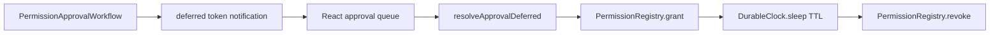

# Model permission approval as durable workflow

## What we set out to do

Issue #1093 asked permission approval to survive a quit-and-resume cycle. The intended shape was a durable workflow that emits an approval prompt, waits on a `DurableDeferred`, persists grants through `PermissionRegistry`, audits through `EventLog`, and revokes time-bounded grants after `DurableClock.sleep`.

## What actually ended up working

The workflow shape works when the approval boundary treats every external dependency as part of the durable contract. `PermissionApprovalWorkflow` declares the approval rule, emits audit events, publishes the deferred token through a notification callback, waits for `resolveApprovalDeferred`, grants or denies, and handles TTL revocation. The React helper keeps a pending approval queue and only removes a prompt after the resolver effect succeeds.

## What surfaced in review

Round 1 found that approval failures were not observable enough: the React queue dropped resolver failures with a floating `runPromise`, and the workflow converted registry/audit failures into defects with `orDie`. Round 2 required a regression test for the new typed failure path. Round 3 had no findings after registry failures were mapped into `PermissionApprovalFailed` and tested.

## First-principles postmortem

The invariant is that an approval is a trust-boundary decision, not a UI convenience. If persistence or audit fails, the system must not silently remove the prompt or convert the problem into an untyped defect. Durable workflow only buys correctness if dependency failures remain part of the workflow result.

## Game-theory postmortem

The local incentive was to make the happy path easy: remove the prompt immediately and let workflow internals crash on infrastructure failures. That optimizes the demo but creates a bad production equilibrium where operators cannot distinguish denial, audit failure, registry failure, or lost UI resolution. The better mechanism is to keep prompts pending until success and make external failures typed.

## Non-obvious lesson

Durable approval flows need typed infrastructure failure, not only typed user denial. A denied prompt and a failed audit write are different operational facts and must stay different in the workflow contract.

## Reproducible pattern (if any)

At approval boundaries, remove UI only after the resolver effect succeeds.
Map registry, audit, and revocation failures into typed workflow errors.
Add a regression test for at least one dependency failure phase.

## AGENTS.md amendment candidate (if any)

Approval and permission workflows must model dependency failures as typed workflow errors rather than defects. Why: trust-boundary decisions need operator-visible failure modes.

This is a proposal. Review and edit AGENTS.md yourself if you want to adopt it — `/learn` never auto-edits AGENTS.md.
