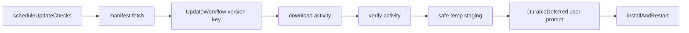

# Build durable updater workflow on effect/unstable/workflow

## What we set out to do

Issue #1089 asked the updater flow to move from ad hoc retry into a durable workflow: scheduled manifest polling, bundle download, signature verification, atomic staging, durable user confirmation, and apply on restart with idempotency by target version.

## What actually ended up working

The PR added `UpdateWorkflow`, `UpdateWorkflowLayer`, `scheduleUpdateChecks`, and a durable user prompt resolver. Manifest and bundle fetches run through `HttpClient`, updater operations go through the existing `Updater` service port, and the workflow uses `Activity`, `DurableClock`, `DurableDeferred`, and compensation for staged update cleanup.

## What surfaced in review

Round 1 found that no updater workflow test exercised the new workflow surface. Round 2 found that manifest versions were interpolated directly into the staging path. Round 3 found that the poll loop used `orDie` for manifest JSON parsing, so malformed poll responses could kill the scheduler as defects.

## First-principles postmortem

Updater workflows run on untrusted remote input and mutate installation state. Remote manifest fields must be validated before becoming filesystem paths, and poll failures must remain recoverable because a scheduler that dies on one bad response stops providing updates.

## Game-theory postmortem

The local incentive was to expose the workflow API and keep the implementation small. That left the highest-risk paths untested: remote malformed data, signature failure, and background-loop failure handling. The better mechanism is to test one negative path per external boundary before treating the workflow as wired.

## Non-obvious lesson

Long-running schedulers should not use `orDie` inside their loop. A defect in one iteration becomes a stopped scheduler, which is a production outage disguised as local simplification.

## Reproducible pattern (if any)

For update workflows, add tests for signature failure and unsafe manifest fields before testing the happy path.
Treat manifest fields as untrusted input even when they come from the updater service.
Use typed failures at poll boundaries so a bad response skips a tick instead of stopping the loop.

## AGENTS.md amendment candidate (if any)

Long-running background loops must not call `orDie` on external input. Why: one malformed response can permanently stop the worker.

This is a proposal. Review and edit AGENTS.md yourself if you want to adopt it — `/learn` never auto-edits AGENTS.md.
