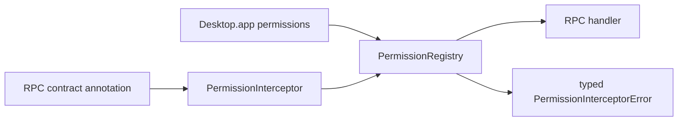

# Expose permissions as RpcGroup interceptor middleware

## What we set out to do

Issue #1090 asked permission checks to become RPC middleware instead of ad hoc handler code. Contracts needed a capability annotation, app configuration needed to declare the capabilities a contract requires, and denied calls needed to be enforced through the shared permission registry.

## What actually ended up working

The PR added `CapabilityAnnotation`, `PermissionInterceptor`, capability constructors under `P`, and `validatePermissions`. Annotated RPCs now read their required capability from the RPC metadata, build a permission context for the configured actor, and check the shared registry before running the handler. Permission-free apps keep a self-contained `Desktop.app()` layer, while apps that declare permissions require the registry dependency that middleware must share.

## What surfaced in review

Round 1 found that `Desktop.app()` always required `PermissionRegistry`, leaking a permission dependency into apps with no declared permissions. Round 2 found that `validatePermissions` only matched capability kind, so a declaration for one filesystem root could satisfy a contract requiring another root. Round 3 found that denied RPCs used `orDie`, turning policy denial into a defect instead of a typed middleware failure.

## First-principles postmortem

Permission middleware is a policy boundary. The boundary must use one coverage rule for config validation and runtime enforcement, and policy denial must stay an expected error because a denied request is correct system behavior.

## Game-theory postmortem

The local incentive was to make middleware compose cleanly with existing RPC types. That made `orDie` tempting because it preserves a narrow type at the cost of hiding the policy outcome. The better mechanism is to model the denial explicitly in the middleware schema and test the denied path, not only the allowed path.

## Non-obvious lesson

Configuration validation and runtime enforcement must share the same predicate. If the app validator and the registry each answer "does this declared capability cover this requested capability?" independently, they will drift.

## Reproducible pattern (if any)

For permission boundaries, export one coverage predicate and reuse it at every validation point.
Do not use `orDie` for policy denial; denied access is expected behavior.
Keep empty configurations dependency-free so optional subsystems do not leak into simple apps.

## AGENTS.md amendment candidate (if any)

Permission features should include a denied-path regression test that asserts the denial is typed, not a defect. Why: policy denial is a normal outcome and must remain observable to callers and operators.

This is a proposal. Review and edit AGENTS.md yourself if you want to adopt it — `/learn` never auto-edits AGENTS.md.
