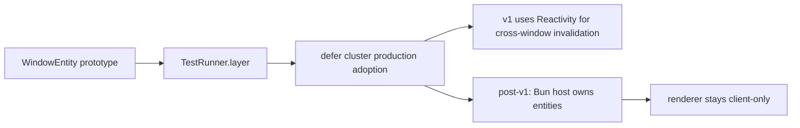

# Prototype effect/unstable/cluster for multi-window state

## What we set out to do

Issue #1096 asked for an R&D verdict on whether `effect/unstable/cluster` should become the multi-window coordination model. The prototype needed to model windows as cluster entities, evaluate singleton and cron primitives for runtime services, sketch the renderer transport, and record a go/no-go decision before production code depended on the shape.

## What actually ended up working

The useful result was a negative production verdict with a small compiled prototype. `WindowEntity` proves entity routing and per-window state isolation against `TestRunner.layer`. `Singleton.make` and `ClusterCron.make` compile as the intended shared-service and scheduled-task primitives. The renderer runner investigation changed direction: a full `WebViewRunner` would make renderer windows shard owners, which is the wrong topology for single-host desktop. If cluster is revisited post-v1, the Bun host should own entities and renderer windows should remain client-only through `SocketRunner.layerClientOnly`.

## What surfaced in review

Round 1 fixed two correctness/documentation issues: the prototype used an elided `Effect.Effect<MessagePortLike>` type against the repo's Effect v4 arity rule, and the ADR overstated verification by marking configured-but-untested passivation and cron behavior as complete. Round 2 found stale ADR language that still treated a custom `WebViewRunner` as required after the verdict rejected it. Round 3 had no findings after the ADR consistently separated tested behavior, configured structure, and deferred production paths.

## First-principles postmortem

The invariant was that an R&D prototype must reduce uncertainty, not smuggle a dependency into production. The prototype showed that the actor model fits some future state ownership problems, but the v1 problem is live-query invalidation, already covered by Reactivity. The clean decision is to keep cluster out of the runtime spine until the API stabilizes and a second renderer IPC surface is worth the operational cost.

## Game-theory postmortem

The local incentive was to preserve all promising cluster language because the entity model feels directionally right. That creates a bad repeated-game outcome: future work treats exploratory code and aspirational ADR text as permission to add an unstable production dependency. The review mechanism forced the ADR to name the rejected path and leave only the client-only topology as a future option.

## Non-obvious lesson

A prototype can succeed by saying "not yet." The valuable artifact is not the amount of code retained; it is the removal of an unsafe production option from the decision space while preserving enough tested shape to revisit the idea later.

## Reproducible pattern (if any)

For R&D branches, record three states separately: tested behavior, compiled-but-untested structure, and rejected design paths.
Use ADR language that makes the future cheap move the correct move.
Do not let exploratory `effect/unstable` imports cross into production surfaces without a fresh adoption decision.

## AGENTS.md amendment candidate (if any)

R&D ADRs should label configured-but-untested behavior as partial, not complete. Why: checkmarks on unexercised behavior turn exploratory evidence into false production confidence.

This is a proposal. Review and edit AGENTS.md yourself if you want to adopt it — `/learn` never auto-edits AGENTS.md.
