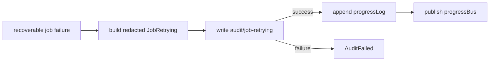

# Publish job retry progress after audit success

## What we set out to do

`Job` was publishing `JobRetrying` progress before the matching audit row was accepted. When audit append failed, the job result failed but progress replay still claimed a retry happened, leaving runtime progress and the durable incident record in disagreement.

## What actually ended up working

The final code made audit success the commit point for retry progress. `emitRetrying` still constructs the redacted `JobRetrying` event first so audit details match the public progress shape, but it writes `audit/job-retrying` before mutating `progressLog` or publishing to `progressBus`. The fix also preserves `JobAuditFailedError` through `jobErrorFromCause`, because otherwise the audit failure was wrapped as a generic `JobFailedError`.

## What surfaced in review

The code review found no issues. The main implementation discovery happened during verification: reordering the audit fixed replay divergence, but the result path still converted `AuditFailed` into `JobFailed` until `jobErrorFromCause` was taught to preserve the typed audit failure.

## First-principles postmortem

The invariant was that retry progress and audit rows are two views of the same operational event. If the durable audit write fails, the retry event has not committed. The subtle boundary was not just publication order; it was the typed error boundary that reports why the event did not commit.

## Game-theory postmortem

Publishing progress first optimizes for live feedback and makes the durable record pay the consistency cost later. Under incident pressure, that creates two competing histories: devtools replay says the retry happened while audit says it did not. Making audit the commit point aligns the incentives: observers only see retry evidence after the system has accepted the durable audit row.

## Non-obvious lesson

When a runtime exposes both a live stream and a durable audit log for the same event, the durable write should define the event's commit point. Reordering the side effects is not enough if the error-normalization path hides the durable write failure behind a generic wrapper.

## Reproducible pattern (if any)

- Identify every observer of an operational event.
- Pick one commit point for that event.
- Mutate replay buffers and publish streams only after the commit point succeeds.
- Preserve the typed commit failure through outer result normalization.

## AGENTS.md amendment candidate (if any)

For event streams backed by audit or durable state, publish only after the durable commit succeeds. Why: live observers and incident records must not be allowed to diverge.

This is a proposal. Review and edit AGENTS.md yourself if you want to adopt it - `/learn` never auto-edits AGENTS.md.
