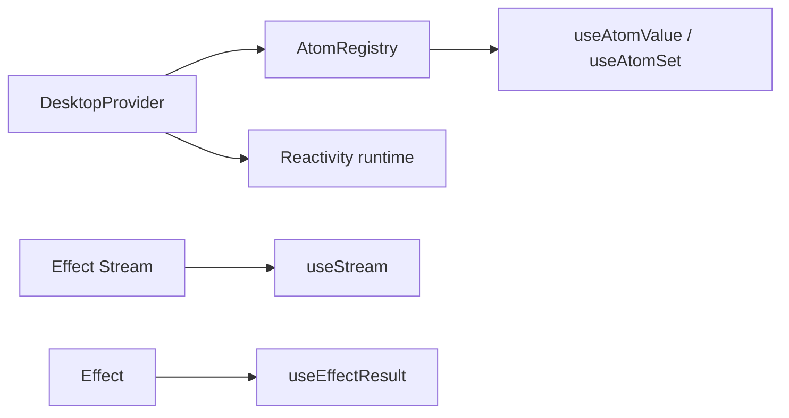

# Adopt effect/unstable/reactivity for renderer hooks

## What we set out to do

Issue #1083 asked the React renderer package to adopt `effect/unstable/reactivity`, expose atom and stream hooks, and centralize renderer runtime context through `DesktopProvider`.

## What actually ended up working

The PR added atom hooks, stream/effect hooks, native-event hook helpers, and a provider-owned `AtomRegistry` plus managed Reactivity runtime. The package index now re-exports the new renderer primitives alongside the already-merged permission approval surface.

## What surfaced in review

Round 1 found that `DesktopProvider` stored context in a ref once and ignored later `client` or `currentWindow` prop changes. Round 2 found that `useAtomValue` mounted atoms inside `getSnapshot`, making a React snapshot read perform registry mutation without paired cleanup. Round 3 found that `useEffectResult` suppressed state updates after cleanup but left the underlying Effect running.

## First-principles postmortem

React hooks are lifecycle adapters. The adapter must attach resources when React subscribes or mounts, detach them when React cleans up, and keep context values aligned with the props React is currently rendering.

## Game-theory postmortem

The local incentive was to keep each hook tiny. That can hide lifecycle obligations because a stale ref or uninterruptible promise looks simpler than a paired acquire/release. The better mechanism is to review each hook as a resource boundary: what does it acquire, when does React release it, and what happens if props change?

## Non-obvious lesson

`getSnapshot` in `useSyncExternalStore` must be treated as a pure read. If it mounts or subscribes, React can invoke it more often than expected and the hook leaks lifecycle state.

## Reproducible pattern (if any)

Memoize provider context from the props that define it, and clean up the same context instance.
Put atom mount/unmount in the subscription lifecycle, not snapshot reads.
Run long Effects in fibers from hooks and interrupt those fibers on cleanup.

## AGENTS.md amendment candidate (if any)

React hooks that start Effect work must pair the started fiber or subscription with cleanup in the same hook. Why: suppressing state updates is not the same as stopping work.

This is a proposal. Review and edit AGENTS.md yourself if you want to adopt it — `/learn` never auto-edits AGENTS.md.
