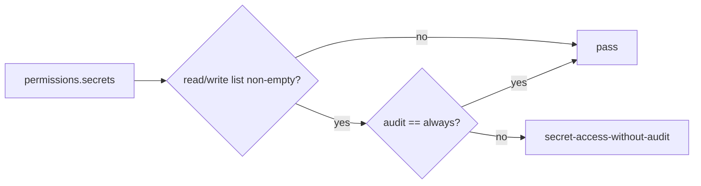

# Require audit for wildcard secret access

## What we set out to do

The production checker needed to fail any declared secret access without `permissions.secrets.audit: "always"`. The bug was that `secretAuditRule` reused `hasScopedList`, a predicate that intentionally treats `["*"]` as unscoped and therefore false, so wildcard secret read/write access could bypass the audit rule.

## What actually ended up working

The issue architecture matched the final code: `secretAuditRule` now asks whether `read` or `write` is a non-empty list, while `hasScopedList` remains unchanged for filesystem and process checks. The tests lock the three relevant boundaries: wildcard reads fail without always-on audit, wildcard writes fail without always-on audit, and a secrets policy with no read/write access still passes without audit.

## What surfaced in review

The code review found no issues. The important review pressure was confirming the change stayed in `packages/config` and did not alter runtime `Secrets` authorization, because issue #872 scoped the problem to production checking.

## First-principles postmortem

The invariant was simple: if a production app declares secret access, production checks must require an always-on audit policy. The broken assumption was that one list predicate could answer both "is this permission scoped?" and "does this permission grant access?" Those are different facts. Scope validation asks whether a declaration narrows access; audit validation asks whether access exists at all.

## Game-theory postmortem

The bad local move was reusing the nearest helper because it already accepted a list and returned a boolean. That made maintenance cheaper in the moment and moved risk to security reviewers who trust the production checker. The alignment mechanism is naming predicates after the question they answer, so future code has to choose between "has scoped list" and "has any list" explicitly instead of inheriting hidden wildcard semantics.

## Non-obvious lesson

Wildcard values invert meaning across rules. For filesystem and process scope checks, `"*"` means "not scoped enough"; for secret audit checks, `"*"` means "maximum access and therefore must be audited." A shared helper is safe only when every caller assigns the same security meaning to the sentinel values.

## Reproducible pattern (if any)

- Identify sentinel values such as `"*"`, `null`, or empty lists before reusing a predicate.
- Name the predicate after the invariant it proves, not the data shape it inspects.
- Add one regression test for the sentinel and one for the absence of the capability.

## AGENTS.md amendment candidate (if any)

Security predicates that inspect wildcard or sentinel values should be named after the security invariant they prove. Why: one sentinel can mean "too broad" in one rule and "definitely access" in another.

This is a proposal. Review and edit AGENTS.md yourself if you want to adopt it - `/learn` never auto-edits AGENTS.md.
