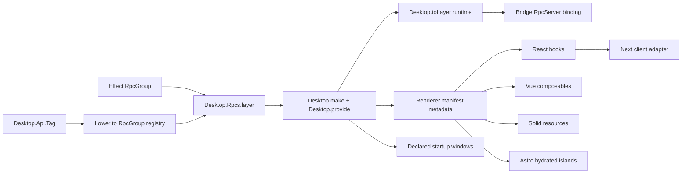

# Unify desktop APIs around Effect RpcGroup

## What we set out to do

Make Effect `RpcGroup` the canonical renderer-callable desktop API boundary. The issue required one typed contract, one implementation path, one app assembly model, and framework-native React, Vue, Solid, Next, and Astro consumption without hand-written normal-path clients or raw bridge access. It also required the old `Desktop.Api.Tag` surface to lower into `RpcGroup` so compatibility did not preserve a second authority model.

## What actually ended up working

The final shape still follows the issue architecture, but the review forced the design to become stricter about where authority lives. `Desktop.make`, `Desktop.provide`, and `Desktop.Rpcs.layer` assemble the app; runtime binding now installs provided `RpcGroup` layers into the bridge RPC server; React, Vue, and Solid derive clients from the renderer transport and descriptors; Next and Astro sit on top of those framework adapters; startup windows are loaded from the app module and opened by the host/runtime path.

The important change from the original plan is that descriptor manifests are renderer-safe metadata, not runtime authority. The runtime still owns implementation layers. Legacy `Api.Tag` compatibility now lowers into the same RPC registry instead of keeping a separate handler path, but the public full `RpcGroup` identity is preserved while an internal served group omits unsupported legacy event RPCs.

## What surfaced in review

Every review thread was addressed; none were intentionally pushed back. The first review found the largest gap: RPC descriptors and layers existed, but they were not yet bound into a runtime `RpcServer`, so the public API looked complete without a working renderer-callable path. Later review passes caught authority and lifecycle issues: renderer adapters importing full app definitions, duplicated RPC layer construction, missing permission validation for RPC annotations, lossy endpoint names, query effects that survived component disposal, and startup windows declared in app code but not used by runtime launch.

The final review passes changed smaller but material details: Windows module paths must be URL-encoded correctly, legacy event omission cannot replace the public `RpcGroup` identity, default app launches must declare startup windows instead of relying on a synthesized fallback, endpoint maps must tolerate `__proto__` as data, and shared transports must namespace request IDs by logical client.

## First-principles postmortem

The invariant was that every renderer-callable capability has exactly one contract and exactly one runtime dispatch path. A descriptor is not a dispatcher, and an Effect `Layer` in an environment is not a bridge server. The missing primitive early in the work was the distinction between contract identity, served request set, implementation authority, and renderer metadata.

Once those were separate, the design became simpler: public code imports the stable `RpcGroup`; runtime code can bind only the served subset; renderer code receives metadata and a transport-derived client; private symbols and WeakMaps preserve compatibility state without widening the SDK surface.

## Game-theory postmortem

The bad local incentive was to make examples compile by handing framework adapters a client map, while leaving the real runtime boundary unproven. That would reward a shallow SDK surface: app authors copy the easy path, reviewers see green tests, and the first real desktop app discovers that descriptors do not dispatch.

The mechanism that aligned the work was repeated review against the issue's invariant: define once, implement once, install once, consume through framework-native primitives. The API snapshot gate also caught when internal served-group metadata accidentally leaked into the public package surface. Future review should check bridge-bound features for a complete four-part path early: contract, implementation layer, server binding, and framework/client consumption.

## Non-obvious lesson

Public `RpcGroup` identity and runtime served RPCs are not always the same thing. Lowering a compatibility surface can require preserving the caller's public group object while serving only the subset the runtime can implement. That compatibility fact belongs behind internal metadata, not in public adapter APIs or descriptor objects.

## Reproducible pattern (if any)

For every cross-boundary framework feature, prove the complete path: contract -> implementation -> transport binding -> framework primitive.
Keep renderer manifests authority-free.
When generated names become object keys, use null-prototype records or maps.
When multiple logical clients share one transport, namespace transport request IDs and restore original IDs at the client boundary.

## AGENTS.md amendment candidate (if any)

When runtime-only metadata is needed to preserve a public contract shape, keep it behind internal symbols or WeakMaps and run the API gate before pushing. Why: compatibility state must not accidentally become SDK surface.

This is a proposal. Review and edit AGENTS.md yourself if you want to adopt it - `/learn` never auto-edits AGENTS.md.
