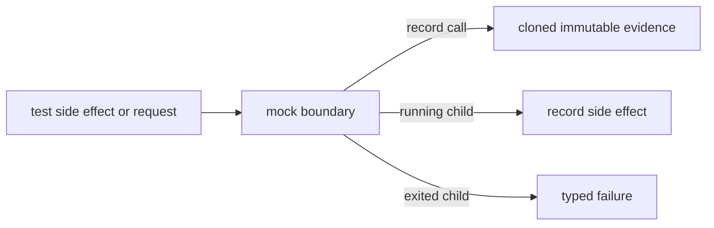

# Harden mock evidence and lifecycle boundaries

## What we set out to do

Three mock issues had the same root shape: tests were allowed to observe behavior that production boundaries would not allow. Mock call snapshots exposed mutable nested state, MockProcess accepted stale stdin writes after exit, and MockPTY accepted stale write and resize calls after exit.

## What actually ended up working

MockHost and MockBridge now clone request payloads when recording calls and return frozen cloned snapshots from `calls()`. MockProcess and MockPTY now track terminal state inside each mock child and reject side-effecting writes after exit while keeping cleanup idempotent.

## What surfaced in review

No external review changed the result. Local verification surfaced one important correction: auto-exiting fixtures cannot finish in a microtask if tests need to perform immediate writes or resizes after opening. The mock should exit on the next timer tick so same-turn setup remains possible, while explicit `await exit` still creates a terminal state.

## First-principles postmortem

Mocks are evidence, not just conveniences. If a test can mutate recorded evidence, or if a mock accepts side effects after terminal state, the mock stops representing the production invariant it claims to stand in for. The source of truth for mock lifecycle is the child running flag; the source of truth for recorded calls is an immutable value snapshot.

## Game-theory postmortem

Mutable snapshots favor local test convenience but create an information asymmetry for reviewers: a passing assertion may be reading evidence rewritten by the test itself. Stale side effects favor easy fixture setup but let lifecycle bugs hide in tests. Cloning, freezing, and terminal-state guards align test author convenience with production-adjacent behavior.

## Non-obvious lesson

Lifecycle mocks need to distinguish immediate setup side effects from stale side effects after an observed exit. Scheduling fixture auto-exit in a microtask can race normal test setup; scheduling it on the next timer tick lets tests write immediately after open while still making `await exit; write()` fail.

## Reproducible pattern (if any)

For production-adjacent mocks:

1. Clone data when recording it as evidence.
2. Return cloned frozen snapshots from read APIs.
3. Gate side-effecting methods on explicit running state.
4. Keep cleanup paths idempotent even after terminal state.
5. Test both the valid pre-exit side effect and the invalid post-exit side effect.

## AGENTS.md amendment candidate (if any)

None.

This is a proposal. Review and edit AGENTS.md yourself if you want to adopt it -- `/learn` never auto-edits AGENTS.md.
