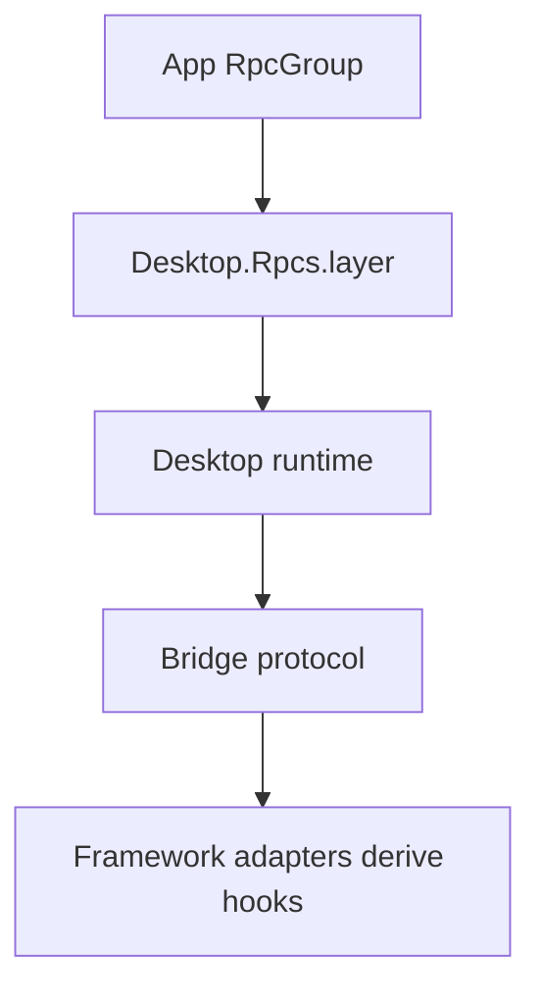

# Remove legacy compatibility surfaces

## What we set out to do

Issue #1148 set one contract rule: renderer-callable framework APIs should be Effect `RpcGroup`s, not the pre-release `Api.Tag` wrapper, compatibility aliases, old handler lowering path, or migration docs. The goal was to remove compatibility code that protected no released users and make the framework easier to reason about.

## What actually ended up working

The landed code matches the issue architecture. Core now exposes `Desktop.Rpcs.layer(...)` and app `rpcs` as the app boundary, bridge exposes `BridgeRpc.group(...)` while still producing real `RpcGroup` values, and native services expose `*Rpcs` groups instead of `*Api` contracts. React no longer exports manual API builders; it derives endpoint hooks from the provided group. The pre-1 migration doc and old secrets migration path were deleted.

The PR diagram still describes the app boundary:

One review-driven change sits outside the original cleanup plan: Rust now reads the host protocol version from `packages/bridge/package.json` at build time so the host and TypeScript bridge keep one version source.

## What surfaced in review

There was one review thread: addressed 1, pushed back 0, escalated 0. The reviewer caught that hardcoding Rust `PROTOCOL_VERSION = "2.0.0"` fixed the immediate startup smoke failure but created future drift from the TypeScript bridge package version. That changed the final design: `crates/host-protocol/build.rs` now reads the bridge package version and sets `EFFECT_DESKTOP_HOST_PROTOCOL_VERSION`, and `lib.rs` consumes that with `env!(...)`.

## First-principles postmortem

The invariant is that a negotiated wire value has one owner. `RpcGroup` ownership was the visible cleanup target, but the startup handshake also compares protocol versions exactly. The original Rust crate version was not the protocol version, and a local hardcoded fix only moved the mismatch from present failure to future failure. The correct primitive was not "make Rust say 2.0.0"; it was "make Rust derive the same contract value that TypeScript owns."

## Game-theory postmortem

The local incentive was cleanup momentum: once the goal is removing legacy surfaces, every old-looking value feels disposable. That can reward narrow fixes that make the current gate pass while leaving two languages to maintain duplicate contract literals. The better mechanism is a single source of truth plus a build-time read that fails if the source disappears. That turns future version bumps from a coordination problem into a normal build dependency.

## Non-obvious lesson

Cross-language protocol values are not ordinary constants; they are contract inputs. The compatibility removal exposed that Rust reported `0.0.0` from its crate while TypeScript expected `2.0.0` from `packages/bridge/package.json`, and the handshake compares those strings exactly. Hardcoding Rust to `2.0.0` fixed the immediate failure but preserved the real bug: two owners for one negotiated value. The durable fix was to make Rust derive `EFFECT_DESKTOP_HOST_PROTOCOL_VERSION` from the bridge package version at build time.

## Reproducible pattern (if any)

Find the producer and consumer of every wire-level version or method name before changing it.
If two languages compare a value exactly, choose one owner and derive the other side from it.
Treat hardcoded agreement as a failing design unless the literal is generated or centrally owned.
Verify through the cross-boundary handshake path, not only package-local tests.

## AGENTS.md amendment candidate (if any)

When a TS/Rust wire-boundary value is negotiated or compared exactly, one package must own it and other languages must derive it through build-time generation or checked fixtures; Why: duplicate literals can pass today and fail on the next routine version bump.

This is a proposal. Review and edit AGENTS.md yourself if you want to adopt it — `/learn` never auto-edits AGENTS.md.
