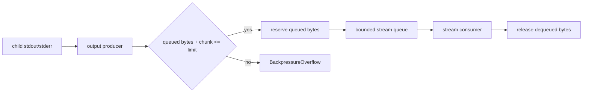

# Track Process output budgets as queued bytes

## What we set out to do

Process stdout and stderr budgets were meant to cap retained stream data, but the implementation counted lifetime emitted bytes. The work was to keep `BackpressureOverflow` for real buffered output overflow while allowing long-running commands to emit unlimited total output when consumers drain the stream.

## What actually ended up working

The working shape is a scoped producer fiber feeding a bounded Effect queue. The producer checks the current retained byte count before each chunk, reserves the bytes before offering the chunk, and the consumer subtracts bytes when dequeuing. This keeps the public `ProcessHandle` API unchanged while moving the accounting into the stream boundary that owns the memory risk.

## What surfaced in review

No review changed the design. The local implementation pass surfaced the important correction: byte accounting must reserve before queue offer, not after, because the consumer can dequeue immediately after the offer.

## First-principles postmortem

The invariant is memory pressure, not throughput. A buffer limit protects bytes retained in process, so bytes that have already crossed the boundary to the consumer no longer belong in the budget. The source of truth is therefore the queue plus its byte reservation ref, not the raw stream's lifetime history.

## Game-theory postmortem

The old lifetime counter aligned with the maintainer's incentive for a small local implementation but punished the app author's normal streaming behavior. The queue-backed accounting shifts the mechanism to the actual contention point: producers can continue when consumers keep up, and they fail only when the system would retain too much output.

## Non-obvious lesson

When a byte budget wraps an asynchronous queue, the producer must reserve bytes before publishing to the queue. Updating the counter after `offerUnsafe` creates a race with a fast consumer: the consumer can release bytes that were never recorded, and the next producer check can undercount retained data.

## Reproducible pattern (if any)

For bounded byte queues:

1. Reject oversized individual chunks before queue interaction.
2. Check retained bytes plus incoming bytes.
3. Reserve bytes before offering.
4. Roll back the reservation if the offer fails.
5. Release bytes only when the consumer dequeues.

## AGENTS.md amendment candidate (if any)

None.

This is a proposal. Review and edit AGENTS.md yourself if you want to adopt it -- `/learn` never auto-edits AGENTS.md.
