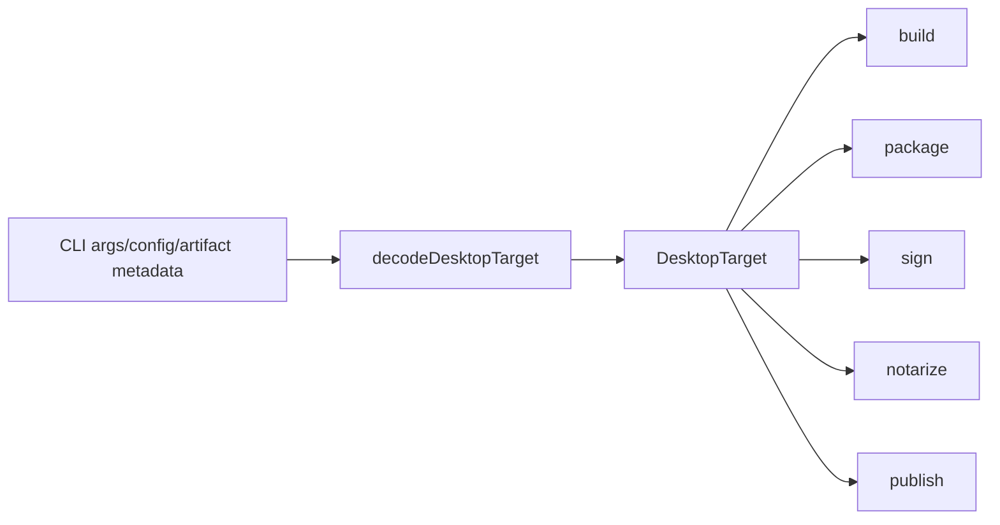

# Centralize release target modeling

## Decision

Pure release-target policy should be a schema-backed value module, not a service or another thin layer.

## What changed

The plan started with one canonical `DesktopTarget` model for build, package, sign, notarize, and publish. The implementation kept that shape, but used `packages/cli/src/targets.ts` as a pure boundary module instead of creating a `TargetService` layer because target parsing, host aliases, artifact sets, binary names, and package architecture strings are deterministic policy.



## Why it mattered

The invariant was one release target vocabulary. A service would have made the code look more Effect-heavy without removing drift; the real drift came from copied string unions, host detection, `startsWith` platform parsing, artifact matrices, and package architecture renderers.

## Example

```ts
export type SignTarget = DesktopTargetId

const resolveSignTarget = (requested: string | undefined, hostTarget: DesktopTarget) =>
  resolveDesktopTarget(requested, hostTarget).pipe(
    Effect.map((target) => target.id),
    Effect.mapError(toSignUnsupportedTarget)
  )
```

## Rule candidate

When the data is pure product policy, prefer a schema-backed value module over an Effect service; reserve services and layers for dependencyful capabilities, lifecycle, or environment access.

This is a proposal. Review and edit AGENTS.md yourself if you want to adopt it — `/learn` never auto-edits AGENTS.md.
