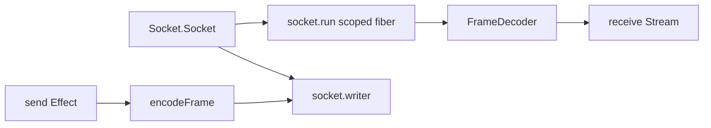

# Shape Framed Transport as Effect Socket Stream

## Decision

Frame encoding is desktop transport policy, but transport lifecycle should be owned by Effect
`Socket`, `Stream`, and `Scope` instead of a Promise adapter.

## What changed

The planned `FramedTransport` removal shipped as a scoped socket binding. Core transport now exposes
`makeFramedSocketConnection(socket, options, operation)`, and `Transport.connect({ target:
"stdio" })` requires a provided `Socket.Socket` plus `Scope.Scope`. The Bun runtime entry provides
`layerStdioSocket` at the integration edge, then builds the host protocol exchange from the scoped
`TransportConnection`.

The host client no longer wraps Promise `send` and `recv` calls. It sends through
`TransportConnection.send` and receives one frame from `TransportConnection.receive` as an Effect
`Stream`. The socket connection maps frame size, truncation, closed, read, write, and close failures
into typed transport errors.



## Why it mattered

The old adapter looked small, but it was a parallel lifecycle model: manual pending-receive state,
manual close signaling, and Promise error conversion outside Effect scope ownership. Moving the
binding onto `Socket` made the useful local code more obvious. Effect owns the resource lifetime and
streaming substrate; Effect Desktop owns only frame bytes and host-facing error tags.

## Example

```ts
const transport = yield * makeTransport()
const connection = yield * transport.connect({ target: "stdio" })
const hostExchange = createHostProtocolExchange(connection)
```

`layerStdioSocket` is provided at the Bun entry edge, so tests can provide a deterministic
`Socket.Socket` without constructing Bun streams.

## Rule candidate

When a local transport abstraction has `send`, `receive`, and `close`, first try to express it as an
Effect `Socket` plus `Stream`; keep only codec or protocol policy local. Why: otherwise small
adapters quietly become second lifecycle runtimes.

This is a proposal. Review and edit AGENTS.md yourself if you want to adopt it.
