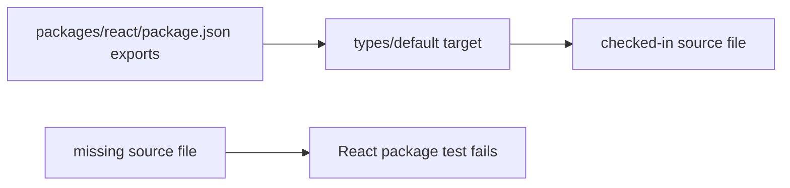

# Fix the React API subpath export

## What we set out to do

`@effect-desktop/react` advertised `./api` in `package.json`, but no `packages/react/src/api.ts` existed. The goal was to make the package boundary truthful: every published React subpath should either resolve to a checked-in source module or be removed.

## What actually ended up working

The smallest correct fix was to remove `./api` rather than create a compatibility barrel. The root export and `./desktop` already expose the real React adapter surface, and no repository code imported `@effect-desktop/react/api`, so adding `src/api.ts` would have created a second name without hiding new complexity.

## What surfaced in review

One review comment changed the final CI shape. The first attempt to remove duplicate push and pull-request validation runs restricted `ci` pushes to `main`, but that dropped validation for non-main direct branch pushes such as release, hotfix, or automation branches. The corrected version restored `push: branches: ["**"]` and moved deduplication into the concurrency key so matching branch and pull-request runs share a branch-based group.

## First-principles postmortem

The invariant was package honesty: a public export map is a loader contract, not documentation. TypeScript can miss this class of bug when a package export points at a file that no checked-in import currently touches, so the test must inspect `package.json#exports` and the filesystem directly. For CI, the invariant was branch coverage: reducing duplicate work must not remove validation for branch states that consumers or automation may read.

## Game-theory postmortem

A phantom export creates a bad local incentive: contributors can copy a published-looking path and only discover the break in a downstream project. A direct export-target test changes that incentive because the cheapest local move is now to keep the manifest and files aligned. The CI review exposed a second incentive problem: optimizing away visible duplicate checks can accidentally make unreviewed branches cheaper to consume without validation, so deduplication belongs in cancellation policy, not in trigger coverage.

## Non-obvious lesson

Package export maps need their own boundary tests. A resolver-facing contract can be broken even when package typecheck and internal imports pass, because no code path is required to import every published subpath. CI trigger changes have the same shape: verify the invariant that must remain true before optimizing visible noise.

## Reproducible pattern (if any)

For package-surface bugs, add a manifest-to-filesystem test before editing the manifest.
For duplicate workflow runs, keep broad triggers and dedupe through concurrency groups.
Review CI changes by asking which branch states lose validation, not only which checks disappear.

## AGENTS.md amendment candidate (if any)

When changing workflow triggers, preserve validation coverage for direct pushes to non-main branches; why: deduplication should cancel redundant runs without making branch states unverified.

This is a proposal. Review and edit AGENTS.md yourself if you want to adopt it — `/learn` never auto-edits AGENTS.md.
