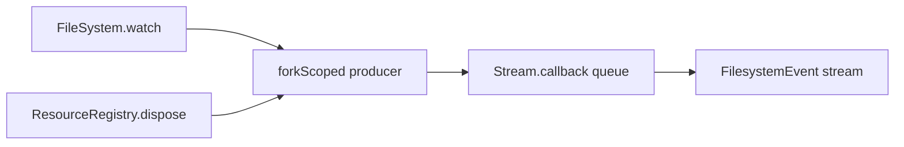

# Model Filesystem Watches as Scoped Effect Streams

## Decision

When a registry-owned stream must be externally closable, disposal must stop the upstream producer directly; it cannot wait for downstream consumers to pull again.

## What changed

The initial filesystem rebase removed the custom watcher adapter, but `Filesystem.watch` still had a local queue and `Effect.runFork` bridge. The shipped shape delegates the upstream event stream to `FileSystem.watch`, converts events through a pure Effect helper, and uses `Stream.callback` with `Effect.forkScoped` so the producer is owned by the stream scope rather than by a detached runtime fiber.



## Why it mattered

The invariant is that the registry owns resource reachability while Stream owns event delivery. A first attempt modeled owner-scope close as a `Deferred` observed by the public stream, but review found that `closeScope` could deadlock while a downstream consumer was busy processing an event. The useful mechanism is a scoped producer: disposal interrupts the upstream watcher directly, while the public stream finalizer only deregisters idempotently.

## Example

```ts
const watchFiber =
  yield *
  fileSystem.watch(authorizedPath).pipe(
    Stream.runForEach((event) => publish(queue, event)),
    Effect.forkScoped
  )
```

## Rule candidate

When a `ResourceRegistry` handle represents a stream, make disposal stop the upstream producer, not the downstream consumer. Why: downstream work may be busy or stalled, but resource cleanup must still complete.

This is a proposal. Review and edit AGENTS.md yourself if you want to adopt it — `/learn` never auto-edits AGENTS.md.
