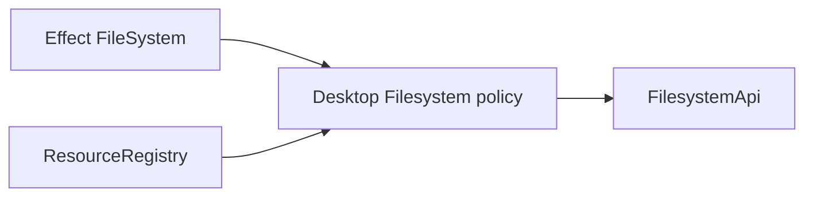

# Rebase Filesystem on Effect FileSystem

## Decision

Rebasing a desktop policy service onto Effect primitives should delete the local adapter entirely, but the policy layer must still compensate for semantic differences where upstream primitives expose less specific filesystem behavior.

## What changed

The plan was to make `Filesystem` depend on Effect `FileSystem` for basic I/O while preserving Effect Desktop's permission and protocol policy. The shipped shape went further than the issue's out-of-scope note: watch streams now also consume `FileSystem.watch`, so the public `FilesystemAdapter`, `RawFilesystemEvent`, and `FilesystemWatcher` contracts disappeared.



Review found three places where "delegate to Effect" was not enough: `stat` follows final symlinks, watch create/remove tags can reflect platform rename quirks, and `EPERM` can arrive as a `PlatformError` with reason `Unknown`. The final implementation keeps Effect as the source of filesystem effects while restoring desktop-level semantics around symlink metadata, watch classification, and host protocol error mapping.

## Why it mattered

The invariant is that Effect Desktop owns authorization and protocol meaning even when it does not own the platform operation. Removing a thin adapter improves the source of truth, but it also removes accidental behavior from Node APIs like `lstat` and errno-first mapping. The useful mechanism was review against the old contract, not only API shape: it caught metadata leaks and event misclassification that typechecks and snapshot updates could not see.

## Example

```ts
const isSymlink = yield * pathIsSymlink(fileSystem, path)
if (isSymlink) {
  return new FilesystemStatResult({
    path,
    kind: "symlink",
    sizeBytes: 0,
    modifiedAtMs: 0
  })
}
```

## Rule candidate

When replacing a local adapter with an Effect primitive, compare the old adapter's observable semantics against the new primitive before deleting the seam. Why: fewer abstractions is only safer if desktop-owned policy such as authorization, symlink identity, lifecycle, and error taxonomy remains explicit.

This is a proposal. Review and edit AGENTS.md yourself if you want to adopt it — `/learn` never auto-edits AGENTS.md.
