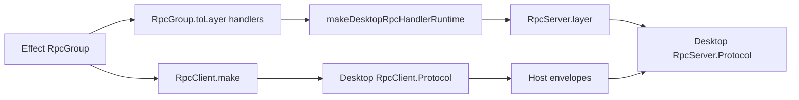

# Replace BridgeRpc Runtime DSL

Issue: #1264

## What changed

Native capability runtimes no longer use `BridgeRpc.fromGroup(...)`, `BridgeRpc.layer(...)`, or the
bridge `Client({ ... })` generator for Effect RPC surfaces. Capability modules now expose plain
Effect `RpcGroup` values, handler records typed from `RpcGroup.toLayer(...)`, and host runtime
factories backed by `makeDesktopRpcHandlerRuntime(...)`.

The implementation went wider than the original Screen/Window slice. The same runtime shape now
covers the native capability set, while the bridge package keeps its old `BridgeRpc` helpers only as
transition code and tests. Remaining native `BridgeRpc.Resource(...)` usage is tracked separately in
#1285 because it is schema-handle debt, not the runtime DSL removed here.

## What mattered

The hard part was not deleting the bridge helper names. The hard part was preserving host protocol
semantics that Effect RPC does not model in the same shape: `void` payload encoding, request-id
ownership, renderer cancellation, server defects, duplicate late frames, and typed host errors.

Those rules belong in one desktop protocol adapter. If they are rebuilt inside each capability, the
system says `RpcGroup` is canonical while the runtime still lets bridge-specific specs drift.

## Review changes

Review found that the first adapter pass was still too shallow. Cancellation originally failed the
cancel call instead of interrupting pending dispatch, completed request IDs could be re-dispatched,
custom `nextRequestId` values were ignored, and client-level protocol failures could strand pending
host calls. Fixing those moved the adapter from a name replacement to a real protocol boundary.

## Rule

When replacing a custom runtime DSL with Effect adapters, add adapter-boundary tests for semantic
mismatches before broad capability migration. Matching schemas do not guarantee matching protocol
behavior for `void` payloads, request IDs, cancellation, defects, or late frames.
