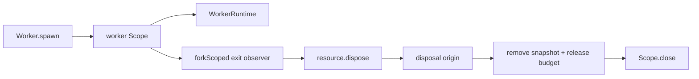

# Own Worker Exit Observers With Scopes

## Decision

Worker lifecycle observers should be owned by the same scope as the runtime they observe, and
observer-driven cleanup needs an explicit origin guard so it does not interrupt itself.

## What Changed

The plan was to remove the last detached `Effect.runFork` in `Worker.spawn`. The shipped shape
creates a per-worker `Scope`, forks `observeWorkerExit` with `Effect.forkScoped`, and uses a
`WorkerDisposalOrigin` ref to distinguish registry cleanup from worker self-exit cleanup.



## Why It Mattered

The non-obvious part is that `resource.dispose()` is still the right single cleanup entrypoint for
self-exit, because it preserves budget release and registry removal. The observer just needs to
claim ownership first so the disposer can skip runtime shutdown and let the observer close the scope
after disposal returns.

## Example

```ts
const origin = yield * claimWorkerObserverDisposal(disposalOrigin)
if (origin !== "registry") {
  yield * resource.dispose()
  yield * Scope.close(workerScope, Exit.void)
}
```

## Rule Candidate

None. The current AGENTS.md hard rules already require scoped ownership for lifecycle work and
architecture-debt sweep notes before closing a ticket.
