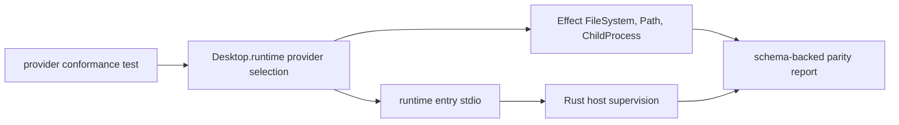

# Prove runtime provider parity

## What we set out to do

Bun and Node runtime support needed real parity evidence. The issue framed this as a shared conformance harness: run the same provider contract against both runtimes, prove startup and service behavior, and keep Deno absent rather than half-supported.

## What actually ended up working

The durable fix was smaller than a public harness. The conformance test now runs one user-level Effect program through `Desktop.runtime({ providers: { runtime } })` for Bun and Node, then checks the selected provider metadata, Effect `FileSystem`, Effect `Path`, scoped `ChildProcess`, typed missing-executable failures, and the absence of a Deno cell. The runtime entry also stopped using `Bun.*` stdio, and the Rust host supervision tests now run the same ready/framed-stdout behavior against both `bun` and `node`.

## What changed from the plan

The planned `RuntimeProviderFixture` and `RuntimeProviderHarness` modules did not become production or exported test APIs. Keeping the contract inline in the test was simpler and avoided creating another local abstraction over Effect. The transport-framing proof also split along the real boundary: TypeScript tests prove the runtime entry can run from a Node-targeted build, while Rust tests prove the host supervisor handles Bun and Node child processes the same way.

## What surfaced in review

Review tightened three places. The missing-executable test originally proved only a generic failure, so it now asserts the typed `PlatformError` details. The `Readable.toWeb(process.stdin)` assertion stayed because it is an external stdio boundary, but it now documents the byte-stream invariant locally. A final cleanup removed provider-layer casts from the test because they were descriptive, not behavioral proof. The accepted risk is that Rust parity tests require `node` on `PATH`; that is intentional real executable coverage and is called out in the plan.

## First-principles postmortem

The invariant was not “there is a runtime provider abstraction.” The invariant was “a provider choice is just Effect Layer substitution until it crosses an executable boundary.” A manifest that says `engine: "node"` does not prove Node support if the entrypoint still calls `Bun.write`. A test that imports provider layers does not prove parity if it never runs the same app-level Effect program through the runtime graph.

## Game-theory postmortem

The bad local incentive is to satisfy provider parity with nominal fixtures or a new harness API because those are easy to review. That creates a support matrix that can pass while the actual launch path stays Bun-shaped. The mechanism that improved alignment was testing through `Desktop.runtime` and the child executable boundary directly. Future reviews should ask whether provider claims execute the same Effect services under the selected runtime, not whether a provider descriptor exists.

## Non-obvious lesson

Provider parity is only real when both the Effect service layer and the executable entrypoint are exercised. The more tempting a reusable harness abstraction looks, the more carefully it should be checked against the architecture-debt rule: if it does not own durable lifecycle or protocol semantics, keep the proof local and let Effect own the shape.

## Reproducible pattern

Run the same user-level Effect program through each provider selection.
Assert typed failures for missing runtime capabilities.
Exercise the executable entrypoint under each claimed runtime.
Keep provider reports schema-backed, but keep test-only harness code local unless it owns durable semantics.

## Rule candidate

None. The `AGENTS.md` hard rules already require Effect-native contracts, wrapper removal, local documentation for unavoidable boundary assertions, and follow-up issues for larger adapter debt.

This is a proposal. Review and edit AGENTS.md yourself if you want to adopt it - `/learn` never auto-edits AGENTS.md.
