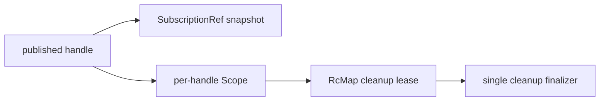

# Rebase resource registry on scoped ownership

## Decision

Moving lifecycle ownership onto `RcMap` and `Scope` is not enough by itself; any
observable registry that publishes handles must also make publication and lease
acquisition one critical section.

## What changed

The plan was to replace the manual `cleanupGroups` and `disposalWaiters` maps
with Effect primitives while keeping desktop handle semantics in
`ResourceRegistry`. That shipped, but the exact shape changed from "RcMap directly
stores host resources" to "RcMap owns cleanup leases while `SubscriptionRef`
remains the devtools-visible registry state."

Review changed the final design. The first pass attached `RcMap` leases after
publishing entries, which meant `dispose` or `closeScope` could see a handle
before its cleanup finalizer existed. The final version serializes registry
mutations with `Semaphore`, runs registration/share/disposal critical sections
uninterruptibly, logs cleanup timeouts, and exposes `ResourceRegistryApi.close()`
for direct factory callers.



## Why it mattered

The invariant is not only "cleanup runs once." The stronger invariant is "no
handle becomes observable until its finalizer ownership is installed." Without
that, replacing a custom lifecycle map with `RcMap` can still leave a race at the
desktop protocol boundary.

## Example

```ts
yield *
  Semaphore.withPermit(
    lifecycle,
    Effect.uninterruptible(
      Effect.gen(function* () {
        const handleScope = yield* Scope.make()
        const allocation = yield* reserveHandle()
        yield* RcMap.get(cleanupResources, allocation.cleanupGroupId).pipe(
          Scope.provide(handleScope)
        )
        return allocation.handle
      })
    )
  )
```

## Rule candidate

When replacing a custom lifecycle registry with Effect `Scope`, `RcMap`, or
`FiberMap`, review the publication point: observable handles, ids, or snapshots
must not be written before their Effect-owned finalizer is installed.

This is a proposal. Review and edit AGENTS.md yourself if you want to adopt it —
`/learn` never auto-edits AGENTS.md.
