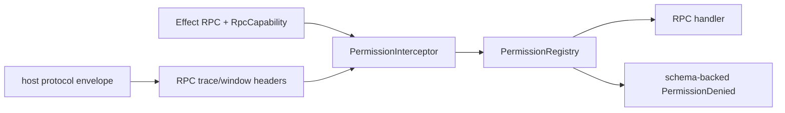

# Run permissions as RPC middleware

## What we set out to do

Protected RPCs needed to fail at the call boundary before user handlers run. The issue framed this as an Effect RPC middleware problem: read capability annotations from the RPC contract, check the permission registry with actor context, and return a schema-backed `PermissionDenied` value in the error channel.

## What actually ended up working

The durable fix was to make bridge `RpcCapability` metadata the single permission annotation source and have `Desktop.toLayer` install `PermissionInterceptor` on served RPC groups. `PermissionInterceptor` now decodes the annotation, builds actor and trace context from RPC headers, checks `PermissionRegistry`, and fails closed for malformed non-`none` capability metadata or malformed caller identity.

## What changed from the plan

The original diagram was directionally right, but review exposed two boundary details that had to be part of the actual architecture. First, the server protocol must forward host trace and window identity into RPC headers or the middleware cannot authorize against the real renderer actor. Second, bridge error translation must decode `PermissionDenied` structurally enough to preserve the original actor, trace, and capability in `cause`; otherwise the host protocol would flatten away the recovery evidence clients need.

## What surfaced in review

Local review found three design gaps. Malformed RPC headers could become constructor defects instead of typed denials, so the final code validates permission context and host identity strings before checking the registry. Permission-denied translation was too loose and lost actor/trace detail, so bridge now decodes a stricter RPC permission-denied shape and preserves the original error as `cause`. The native host RPC runtime path still cannot enforce core permission policy without a bridge/core dependency inversion, so that larger boundary was split into #1293.

## First-principles postmortem

The invariant was not just “check permissions before handlers.” The real invariant was “the contract, caller identity, and policy owner meet at one Effect boundary.” A middleware that reads the wrong annotation source is only a second descriptor path. A bridge that carries method metadata but not actor headers cannot make policy decisions. A host protocol error that drops the original denial context turns typed recovery into a stringly result.

## Game-theory postmortem

Handler-side checks create a bad local incentive: the cheapest way to add an RPC is to implement the handler and forget the permission path. Contract annotations plus automatic middleware invert that incentive because a protected RPC is denied by default unless app permissions declare it. The architecture-debt sweep also avoided a second bad equilibrium: keeping `CapabilityAnnotation` beside `RpcCapability` would let future code choose whichever metadata path was convenient.

## Non-obvious lesson

Security middleware needs the same single-source-of-truth pressure as public API shape. It is not enough for Effect RPC to own the handler pipeline; the metadata and caller identity consumed by the middleware must also be canonical, schema-decoded, and preserved across protocol translation.

## Reproducible pattern

Attach policy requirements to the Effect contract.
Install policy middleware where the contract becomes a served runtime.
Forward caller identity as typed protocol metadata before middleware runs.
Decode and preserve policy failures when crossing back to host protocol errors.

## Rule candidate

None. The `AGENTS.md` hard rules already require wrapper removal, Effect-native contracts, and typed boundary decoding.

This is a proposal. Review and edit AGENTS.md yourself if you want to adopt it - `/learn` never auto-edits AGENTS.md.
