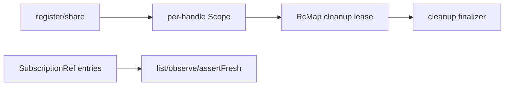

# Issue #1156: Rebase resource registry on scoped ownership

## Objective

Move `ResourceRegistry` cleanup ownership onto Effect scopes and `RcMap` while
preserving the desktop-specific semantics the registry actually owns: serializable
handle shape, generation freshness, scope-parent close ordering, sharing policy,
stale-handle errors, and lifecycle snapshots.

## Pre-change Shape

- `ResourceRegistry` stores live entries in a `SubscriptionRef`.
- Shared cleanup is owned by a bespoke `cleanupGroups` map with mutable
  `remaining` counters.
- Concurrent disposal waits are owned by a bespoke `disposalWaiters` map.
- `share(...)` manually increments cleanup reference counts and writes another
  entry that points at the same cleanup group.
- `dispose(...)` and `closeScope(...)` manually decide when cleanup runs.

## Target Shape

- Keep `SubscriptionRef` as the observable registry state.
- Add a registry-owned root `Scope`.
- Add a registry-owned `RcMap<ResourceId, CleanupLease>` for cleanup groups.
- Each registered or shared handle owns a child `Scope`.
- Registering a handle acquires a cleanup-group lease with
  `RcMap.get(...).pipe(Scope.provide(handleScope))`.
- Disposing a handle closes its handle scope. `RcMap` handles reference counting
  and runs the cleanup finalizer after the last shared handle scope closes.
- Cleanup finalization still applies `disposalGraceMs`, logs failures, and then
  allows the registry entry to be removed.
- Use registry snapshot changes to await in-flight disposal instead of a separate
  waiter map.

## Architecture Debt Sweep

Remove now:

- `cleanupGroups` and manual `remaining` counters.
- `incrementCleanup(...)` / `releaseCleanup(...)`.
- `disposalWaiters`, replacing it with registry-state observation.

Keep:

- `ResourceRegistry` itself. It owns durable desktop semantics that Effect does
  not: public handle identity, stale generation checks, owner-scope relationships,
  sharing across desktop scopes, and devtools-observable snapshots.
- Scope-parent ordering helpers. They express desktop ownership relationships,
  not a duplicate of Effect `Scope`.

Outcome:

- Removed the bespoke cleanup reference-counting layer:
  `cleanupGroups`, `CleanupGroup`, `incrementCleanup(...)`, and
  `releaseCleanup(...)`.
- Removed `disposalWaiters`; duplicate disposals now wait on registry state
  observation instead of a parallel waiter map.
- Added an explicit `ResourceRegistryApi.close()` escape hatch for direct factory
  callers while `ResourceRegistryLive` owns automatic layer finalization.
- No additional zero-policy wrapper over Effect was found in the touched registry
  lifecycle path. Named owner scopes stay because they are desktop handle protocol
  state, not a replacement for Effect `Scope`.

Follow-up:

- #1195 remains the broader resource-domain migration. This issue should make the
  registry substrate Effect-native; later issues can expose scoped APIs for
  individual domains such as windows, processes, PTYs, and workers.

## Verification

- Focused:
  - `bun test packages/core/src/runtime/resources.test.ts`
  - `bun test packages/core/src/runtime/process.test.ts packages/core/src/runtime/pty.test.ts packages/core/src/runtime/worker.test.ts`
  - `bun test packages/core/src/runtime/filesystem.test.ts packages/core/src/runtime/sqlite.test.ts packages/core/src/runtime/commands.test.ts`
- API:
  - `bun packages/cli/src/bin.ts check --api --write`
- Full before push:
  - `bun run format:check`
  - `git diff --check`
  - `bun run typecheck`
  - `bun run lint`
  - `bun run lint:types`
  - `bun run check`
  - `bun test`
  - `bun run build`
  - `bun packages/cli/src/bin.ts check --api`
  - `cargo fmt --check`
  - `cargo check --workspace`
  - `cargo test --workspace`
  - `cargo clippy --workspace --all-targets -- -D warnings`

## Out of Scope

- Replacing all resource domains with scoped public APIs.
- Changing bridge handle wire shape.
- Removing generation freshness checks.
