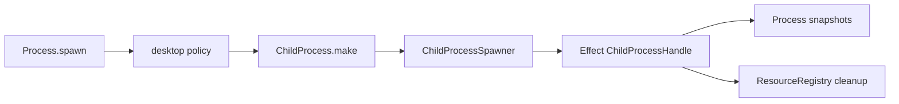

# Issue #1158: Use Effect Child Process Primitives

## Problem

`ProcessAdapter` and `ProcessChild` duplicated the child-process contract that Effect already provides through `effect/unstable/process`. The duplicate shape made Effect Desktop own process spawning, stdio, exit, signal, and tree-kill semantics that should belong to Effect.

## Before

```ts
export interface ProcessChild {
  readonly stdout: ReadableStream<Uint8Array>
  readonly stderr: ReadableStream<Uint8Array>
  readonly exited: Promise<ProcessExitStatus>
  readonly writeStdin: (chunk: Uint8Array) => Promise<void>
  readonly terminateTree: () => Promise<void>
}
```

`Process` wrapped that local child shape and the live implementation called `Bun.spawn` directly.

## After

```ts
const command = ChildProcess.make(input.command, input.args, {
  stdin: { stream: "pipe" },
  stdout: "pipe",
  stderr: "pipe"
})

const child = yield * spawner.spawn(command).pipe(Scope.provide(scope))
```

`Process` now keeps only desktop policy: permission checks, resource registration, process budgets, bounded output, snapshots, host-protocol error mapping, and registry cleanup.

## Architecture



## Verification

- `bun test packages/core/src/runtime/process.test.ts`
- `bun test packages/test/src/index.test.ts -t MockProcess`
- `bun test packages/devtools/src/index.test.ts -t LiveRuntimePanels`

## Architecture-Debt Sweep

Removed now: `ProcessAdapter`, `ProcessChild`, `BunProcessAdapter`, direct `Bun.spawn` process ownership, process-specific signal assertions, and public `childPids` snapshot/mock/devtools fields.

Kept now: `ProcessApi` and `ProcessHandle`, because they carry durable desktop semantics: permissions, resource handles, owner scopes, budgets, snapshots, and host-protocol errors.

Follow-ups: #1159 should own exit observer fibers with scopes; #1171 should replace manual per-owner process counters with Effect concurrency primitives; #1297 should remove the remaining `BridgeRpc` contract adapter once the bridge protocol descriptors can be derived directly from Effect `RpcGroup` metadata.
