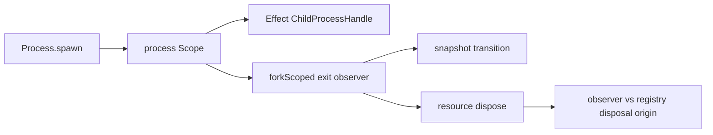

# Issue #1159: Own Process Exit Fibers With Scopes

## Problem

`Process` still starts the child exit observer with `Effect.runFork`, which creates a detached runtime fiber outside the process resource scope. That duplicates lifecycle ownership that Effect already provides through scoped fibers.

## Before

```ts
Effect.runFork(
  exitStatus.pipe(
    Effect.flatMap((status) => completeExit(status)),
    Effect.catch((error) => recordExitFailure(error))
  )
)
```

The observer outlives the lexical Effect scope unless its own logic reaches disposal.

## After

```ts
yield* observeChildExit(...).pipe(Scope.provide(processScope))
```

```ts
const observeChildExit = (...): Effect.Effect<void, never, Scope.Scope> =>
  exitStatus.pipe(
    Effect.flatMap(completeExit),
    Effect.catch(recordExitFailure),
    Effect.forkScoped({ startImmediately: true }),
    Effect.asVoid
  )
```

The process scope now owns the child process and the exit observer fiber. Closing the process resource closes the process scope, which interrupts the observer if the child has not produced an exit yet. A local disposal-origin state prevents the observer from re-entering `resource.dispose()` while `ResourceRegistry.closeScope(...)` is already disposing the same handle.

## Architecture



`Process` keeps only desktop-specific policy: permissions, owner scopes, registry handles, budgets, bounded output, snapshots, and host-protocol errors.

## Verification

- Process scope close interrupts the exit observer when the child never reports exit.
- Process scope close still disposes the process resource once.
- Registry-driven disposal does not deadlock when killing the child completes `exitCode`.
- Existing spawn, exit, kill, bounded stream, and Bun child-process tests continue to pass.

## Architecture-Debt Sweep

Removed now: detached process exit observer fibers.

Kept now: `ProcessApi` and `ProcessHandle`, because they own durable desktop policy around Effect child processes.

Existing follow-up: #1171 should replace manual per-owner process budget counters with Effect concurrency primitives.
