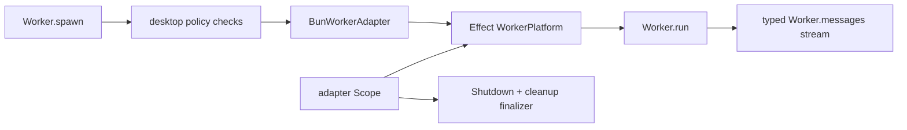

# Issue #1160: Replace Worker Adapter With Effect Workers

## Problem

`BunWorkerAdapter` owned raw worker construction, event listeners, queue writes, exit signaling, shutdown, and detached `Effect.runFork` calls directly. That duplicated lifecycle and message-loop machinery already modeled by Effect's unstable worker primitives.

## Before

```ts
const queue = yield * Queue.bounded(input.messageBufferSize)
const worker = yield * Effect.try({ try: () => new globalThis.Worker(input.script) })

const onMessage = (event: MessageEvent): void => {
  Effect.runFork(Queue.offer(queue, event.data))
}

worker.addEventListener("message", onMessage)
```

The adapter translated callbacks into queue effects itself, so listener ownership and message execution lived outside Effect's worker substrate.

## After

```ts
const platform = makeBunWorkerPlatform(input, queue, exit, shutdownRequested)
const worker =
  yield *
  platform
    .spawn(0)
    .pipe(Effect.provideService(EffectWorker.Spawner, () => new globalThis.Worker(input.script)))

yield *
  worker.run((message) => Queue.offer(queue, message).pipe(Effect.asVoid), {
    onSpawn: Deferred.succeed(started, undefined)
  })
```

`BunWorkerAdapter` now adapts Bun's raw `Worker` port to `effect/unstable/workers/Worker.makePlatform`. Effect owns the worker run loop and scoped listener finalizers. Effect Desktop keeps desktop-specific policy: raw app-worker message compatibility, shutdown message semantics, channel schema validation, permissions, resource registry integration, snapshots, and host-facing errors.

## Architecture



The platform shim unwraps Effect worker outbound envelopes before `worker.postMessage(...)` and wraps raw worker `message` events as Effect worker data frames. That preserves the existing app-worker protocol while moving listener and run-loop ownership to Effect.

## Verification

- Worker messages still pass through input/output schemas.
- Runtime self-exit still removes the resource and frees the existing budget counter.
- Real Bun workers still send, receive, and close through the default adapter.
- Worker construction failures remain typed `WorkerUnsupportedError` spawn failures.
- Adapter callback code no longer calls detached `Effect.runFork`.
- Worker channel schemas are pure `Schema.Decoder<_, never>` values, so channel decode no longer needs local `as Effect.Effect<..., ..., never>` recovery casts.

## Architecture-Debt Sweep

Removed now: manual callback-to-`Effect.runFork` plumbing in the default Bun worker adapter.

Also removed now: worker channel decode casts that recovered erased Schema service requirements.

Kept now:

- Worker budget counters remain manual and are tracked by #1172.
- Worker message buffering still bridges through a local queue while the public handle exposes a stream; pure scoped stream ownership remains tracked by #1189.
- The worker exit observer still uses detached `Effect.runFork`; follow-up #1299 tracks scoping it like Process and PTY.
