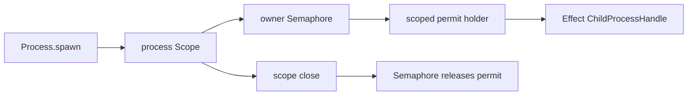

# Issue #1171: Enforce Process Budgets With Semaphores

## Problem

`Process` still models per-owner concurrency with a local `Ref<Map<string, number>>` counter and manual reserve/release helpers. That duplicates permit lifecycle semantics already owned by Effect `Semaphore`.

## Before

```ts
const processBudgets = yield * Ref.make(new Map<string, number>())
yield * reserveProcessBudget(processBudgets, input.ownerScope, budgets.maxConcurrent)
// ...
yield * releaseProcessBudget(processBudgets, input.ownerScope)
```

The budget is a custom counter protocol. Every spawn, adapter failure, child exit, and scope close path must remember to release it.

## After

```ts
const processBudgets =
  yield *
  RcMap.make({
    lookup: (_ownerScope: string) => Semaphore.make(budgets.maxConcurrent)
  })
```

```ts
yield * holdProcessBudgetPermit(processBudgets, processScope, input.ownerScope, maxConcurrent)
```

The keyed owner-scope lookup is `RcMap`, the budget primitive is `Semaphore`, and the permit holder is scoped to the process lifetime. Closing the process scope interrupts the holder fiber, so the semaphore releases the permit through Effect's own `withPermitsIfAvailable` finalizer.

## Architecture



`Process` keeps desktop policy: owner-scope validation, resource handles, process snapshots, child shutdown policy, and host-protocol errors. Effect owns concurrency permits.

## Verification

- Concurrent spawn limits remain enforced per owner scope.
- Parallel spawn races still admit only the configured number of children.
- Child exit releases the permit for later spawns.
- Adapter spawn failure releases the permit for later spawns.
- Existing process lifecycle, stream, kill, and Bun child-process tests continue to pass.

## Architecture-Debt Sweep

Removed now: manual per-owner process budget counters and reserve/release helpers.

Kept now: the `Process` service boundary, because it owns desktop-specific permissions, owner scopes, resource registry integration, snapshots, shutdown policy, and error mapping.
