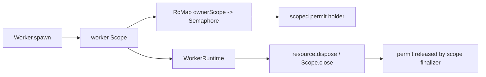

# Issue #1172: Enforce Worker Budgets With Semaphores

## Problem

`Worker` still tracks per-owner concurrency with a mutable `Ref<Map<string, number>>`. That repeats
semaphore semantics in local code and forces worker cleanup paths to remember to decrement counters
manually.

## Before

```ts
const reserved =
  yield *
  Ref.modify(workerBudgets, (current) => {
    const runningWorkers = current.get(ownerScope) ?? 0
    if (runningWorkers >= maxConcurrent) return [false, current]

    const next = new Map(current)
    next.set(ownerScope, runningWorkers + 1)
    return [true, next]
  })
```

## After

```ts
const workerBudgets =
  yield *
  RcMap.make({
    lookup: (_ownerScope: string) => Semaphore.make(maxConcurrent)
  })

yield * holdWorkerBudgetPermit(workerBudgets, workerScope, ownerScope, maxConcurrent)
```

Each worker owns a scoped permit holder. Closing the worker scope releases both the permit and the
`RcMap` reference, so spawn failure, registry disposal, and worker self-exit share the same release
mechanism.

## Architecture



`Worker` keeps desktop-specific policy: permission checks, channel schemas, resource registry
ownership, worker snapshots, shutdown behavior, and host-facing errors. Effect owns concurrency
admission and permit release.

## Verification

- Worker spawn fails with `WorkerResourceBusyError` when the owner scope has no available permit.
- Different owner scopes receive independent permit pools.
- Adapter spawn failures release the permit.
- Worker self-exit and registry cleanup release the permit through scope closure.

## Architecture-Debt Sweep

Removed now: manual worker budget counters and release helpers.

Kept intentionally:

- The message queue bridge remains for #1189.
