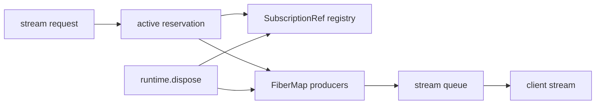

# Issue #1182: Rebase Bridge Stream State On Effect Primitives

## Current State

`packages/bridge/src/streams.ts` owned stream registry state with mutable `Map`
collections and manual observer fanout through a `Set<Queue.Enqueue<...>>`.
The runtime also tracked active producers with separate request and resource
maps, then manually interrupted fibers.

Before:

```ts
const entries = new Map<string, BridgeStreamRegistryEntry>()
const observers = new Set<Queue.Enqueue<ReadonlyArray<BridgeStreamRegistryEntry>, never>>()

const publish = () => {
  const current = Array.from(entries.values())
  for (const observer of observers) {
    Queue.offerUnsafe(observer, current)
  }
}
```

## Target Shape

The bridge keeps protocol-specific stream state, but Effect owns observable
state and active fiber lifecycle.

After:

```ts
const state =
  yield *
  SubscriptionRef.make<BridgeStreamRegistryState>({
    entries: new Map(),
    generations: new Map()
  })

const active = yield * FiberMap.make<string, void, never>()
```

## Architecture

- `BridgeStreamRegistry` stores visible stream entries and generation history in
  a `SubscriptionRef`.
- `BridgeStreamRuntime` owns active producer fibers with `FiberMap`, keyed by
  stream id.
- Active stream reservation is atomic, so duplicate request ids or duplicate
  generated stream ids cannot both pass under concurrency.
- `runtime.dispose()` closes every active stream through the same terminal
  cleanup path as cancellation, interrupts producers, closes the owned scope,
  and rejects post-dispose stream starts.



## Verification

- Stream registry observation still emits the current snapshot and updates.
- Duplicate terminal transitions remain single-writer.
- Terminal entries still expire after cleanup grace while generation history is
  retained.
- Duplicate request ids and duplicate generated stream ids fail.
- Runtime disposal interrupts active producers, emits closed terminal state, and
  rejects later stream starts.
- Cancellation cleanup still runs when a closed frame cannot be encoded.

## Debt Sweep

Removed now:

- Manual observer `Set` fanout.
- Manual active request/resource maps.
- Check-then-insert duplicate ownership logic.

Kept intentionally:

- Bridge stream frame schemas, because they are wire protocol.
- Stream queue/backpressure policy, because it owns bridge-specific overflow,
  terminal-frame preservation, and metrics.
- `BridgeStreamRegistry`, because devtools need a domain stream snapshot
  contract rather than raw Effect internals.

Follow-up already tracked:

- #1274 covers rebasing the separate bridge EventHub on Effect `PubSub`.
