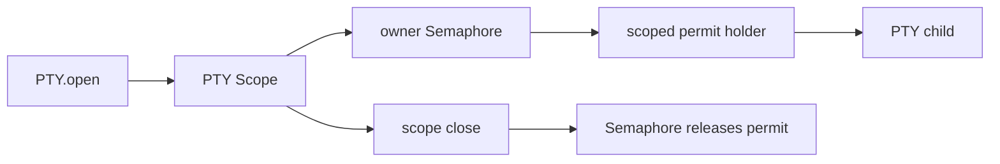

# Issue #1183: Gate PTY Concurrency With Semaphores

## Problem

`PTY` still models per-owner concurrency with a local `Ref<Map<string, number>>` counter and manual reserve/release helpers. That duplicates permit lifecycle semantics already owned by Effect `Semaphore`.

## Before

```ts
const ptyBudgets = yield * Ref.make(new Map<string, number>())
yield * reservePtyBudget(ptyBudgets, input.ownerScope, budgets.maxConcurrent)
// ...
yield * releasePtyBudget(ptyBudgets, input.ownerScope)
```

The budget is a custom counter protocol. Every open, adapter failure, child exit, and scope close path must remember to release it.

## After

```ts
const ptyBudgets =
  yield *
  RcMap.make({
    lookup: (_ownerScope: string) => Semaphore.make(budgets.maxConcurrent)
  })
```

```ts
yield * holdPtyBudgetPermit(ptyBudgets, ptyScope, input.ownerScope, maxConcurrent)
```

The keyed owner-scope lookup is `RcMap`, the budget primitive is `Semaphore`, and the permit holder is scoped to the PTY lifetime. Closing the PTY scope interrupts the holder fiber, so the semaphore releases the permit through Effect's own `withPermitsIfAvailable` finalizer.

## Architecture



`PTY` keeps desktop policy: permissions, owner scopes, resource registry integration, resize/write/kill validation, child shutdown policy, output metrics, and host-protocol errors. Effect owns concurrency permits.

## Verification

- Concurrent open limits remain enforced per owner scope.
- Adapter open failure releases the permit for later PTY opens.
- Child exit releases the permit for later PTY opens.
- Existing PTY lifecycle, stream, write, resize, and kill tests continue to pass.

## Architecture-Debt Sweep

Removed now: manual per-owner PTY budget counters and reserve/release helpers.

Kept now: the `PTY` service boundary, because it owns durable desktop-specific PTY policy and host protocol translation.
