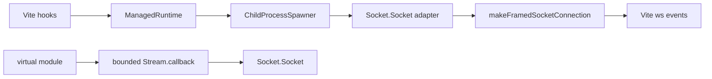

# Issue #1209: Drive Vite Dev Runtime with Effect Process and Socket

## Problem

`packages/vite` starts the runtime child process with raw Node `spawn`, decodes stdout with a local mutable `StdioBridge`, stores frame listeners in arrays, and emits renderer HMR frames from hand-rolled callback state. The Vite hook is an imperative integration edge, but the runtime process, stdin/stdout frame transport, and renderer HMR socket lifecycle should be Effect-owned resources.

## Architecture

## Modules

| Module                                 | Responsibility                                                                                                                                                                 | Interface                                                                                                     | Debt removed                                                                |
| -------------------------------------- | ------------------------------------------------------------------------------------------------------------------------------------------------------------------------------ | ------------------------------------------------------------------------------------------------------------- | --------------------------------------------------------------------------- |
| `packages/vite/src/runtime-process.ts` | Spawn `bun run <entry>` with `effect/unstable/process`, expose framed stdin/stdout through `Socket.Socket`, and close the process scope deterministically.                     | `makeRuntimeProcess(options)` returns a scoped process handle with `send`, `frames`, `exitCode`, and `close`. | Raw Node child-process lifecycle and local stdio bridge.                    |
| `packages/vite/src/hmr-controller.ts`  | Keep Vite callbacks at the edge, run process work through `ManagedRuntime`, restart by closing the old process before acquiring a new one, and forward frames to/from Vite ws. | `makeHmrController(options)` with injectable runtime for tests.                                               | Raw `Effect.runFork`, mutable bridge lifecycle, and restart leaks.          |
| `packages/vite/src/virtual-module.ts`  | Generate the renderer dev socket with a bounded `Stream.callback` over HMR events.                                                                                             | `layerDevSocket` remains the public virtual export.                                                           | Unbounded queue plus detached `Effect.runFork` from browser event handlers. |
| `packages/vite/src/*.test.ts`          | Prove process spawn, frame forwarding, restart cleanup, dispose cleanup, and virtual module guardrails.                                                                        | Bun tests with a fake `ChildProcessSpawner` and fake Vite server.                                             | Source-string-only verification.                                            |

## Architecture-Debt Sweep

- Remove `child-process.ts`: it is a thin raw-Node adapter over behavior Effect process already owns.
- Remove `stdio-bridge.ts`: it is a partial reimplementation of Effect socket/framed transport with mutable handler arrays.
- Keep only Vite-specific adapters: base64 HMR event encoding and the virtual module boundary are durable protocol translation between Vite HMR and Effect socket frames.
- Avoid `unknown as`; narrow the HMR server interface instead of casting test fixtures to `ViteDevServer`.

## Verification

- `bun test packages/vite/src`
- `bun run typecheck`
- `bun run lint`
- `bun run lint:types`
- `bun run format:check`
- `bun run check`
- `bun run build`
- `bun test`
- Rust gates if the full repo validation is otherwise clean.
