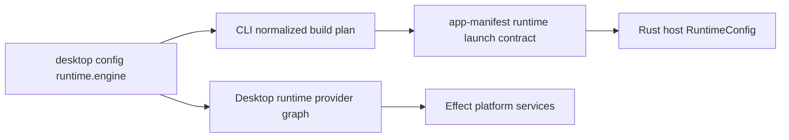

# Issue 1213: Add Bun And Node Runtime Providers

## Problem

Runtime selection is currently Bun-shaped in three separate places:

- public config types only allow `runtime.engine: "bun"`;
- the CLI build pipeline always emits a Bun runtime bundle and Bun-only manifest data;
- the Rust host starts the runtime with `RuntimeConfig::new("bun")` instead of reading a launch contract.

That makes Bun the hidden architecture rather than one runtime provider among supported Effect platform providers.

## Architecture

Make the runtime provider choice a typed launch contract:

The default provider remains Bun. Node is opt-in. Unsupported engines such as Deno fail as typed config diagnostics before build steps run.

## Modules

- `packages/config/src/index.ts`
  - Add `RuntimeEngine` as `"bun" | "node"`.
  - Update `DesktopConfig.runtime.engine` to use the shared type.

- `packages/core/src/runtime/desktop-app.ts`
  - Add the Node provider to the runtime provider graph.
  - Use upstream `BunServices.layer` and `NodeServices.layer` directly, avoiding a new thin layer alias.

- `packages/core/package.json`
  - Add `@effect/platform-node` at the same Effect version as the existing Effect packages.

- `packages/cli/src/index.ts`
  - Normalize `runtime.engine` into a `RuntimeEngine`.
  - Build Bun with `--target=bun` and Node with `--target=node`.
  - Emit normalized runtime launch data: `engine`, `entry`, `executable`, `args`, and `env`.

- `packages/cli/src/package-pipeline.ts`
  - Decode and validate the normalized runtime launch contract.
  - Validate the packaged runtime entry still exists.

- `crates/host/src/runtime/mod.rs`
  - Add a Rust runtime launch manifest type and `RuntimeConfig::from_manifest`.
  - Keep Bun-specific `BUN_INSTALL` discovery only for the Bun provider.

- `crates/host/src/main.rs`
  - Use the packaged manifest when present.
  - Fall back to the source Bun runtime only for local source/dev execution.

## Verification

- Config accepts `runtime.engine: "node"` and keeps rejecting unsupported engines at compile time.
- Core runtime graph exposes `provider:runtime:node`.
- The same provider-backed program runs with Bun, Node, and test providers.
- CLI build emits `--target=node` and Node launch manifest data for Node config.
- CLI rejects `runtime.engine: "deno"` before running commands.
- Package validation accepts Bun and Node launch manifests and rejects malformed launch data.
- Rust tests prove Bun and Node manifests map to the same supervisor config shape.

## Architecture Debt Sweep

Remove in this issue:

- Bun-only runtime config validation.
- Bun-only host startup for packaged apps.
- The existing `BunServicesLayer` zero-policy re-export from the core runtime path.

Follow-up if still too large after this issue:

- Delete `packages/core/src/runtime/platform.ts` if it remains a zero-policy wrapper. Desired after-shape: provider modules import upstream Effect platform layers internally, while public code imports standard Effect service tags directly or through a documented desktop policy surface.
