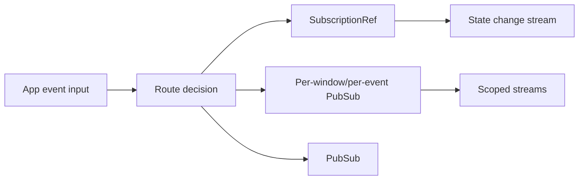

# Issue 1222: Rebase Native App Events On Effect PubSub

## Problem

`packages/native/src/app-events.ts` manually manages subscriber maps, per-subscriber queues, audit
queues, and cleanup for app-level native events. That duplicates Effect's broadcast and observable
state primitives, and it makes lifecycle behavior depend on hand-written queue interruption.

## Architecture



Use `SubscriptionRef` as the single state source for windows, focused window, buffered
first-responder events, and pending per-window replay. Use per-window/per-event `PubSub` channels
for routed event fanout so unrelated windows or event names cannot consume each other's bounded
capacity. Use a replaying sliding `PubSub` for audit buffering. The router keeps only
desktop-specific routing policy: first-responder selection, target validation, per-window pending
replay, audit decisions, and dispatch short-circuiting.

## Modules

- `packages/native/src/app-events.ts`
  - Replace `Ref` + subscriber maps + `Queue` fanout with `SubscriptionRef` state and
    per-window/per-event `PubSub` channels.
  - Replace audit `Queue` with a replaying sliding `PubSub` so late audit observers keep the
    bounded-buffer behavior.
  - Add a schema-coded `AppEventRouterState` snapshot and `observeState()`.
  - Make subscriptions attach directly to their routed channel and end when the target window
    closes.
  - Keep subscription payloads as `unknown`; payload typing belongs at schema-coded event
    boundaries, not a caller-declared generic.
- `packages/native/src/index.test.ts`
  - Preserve existing routing tests.
  - Add regression coverage for state observation, subscription finalization on window close, late
    subscriber behavior, one-time pending first-responder replay, and channel isolation.
- `packages/native/README.md`
  - Update the dependency note from queues/refs to PubSub/SubscriptionRef.
  - Rename router capacity options to event-channel and audit-replay terminology.
- `docs/roadmap/layer-first-issue-order.md`
  - Mark #1222 implemented after validation.

## Architecture-Debt Sweep

Remove now:

- Per-subscriber queue allocation.
- Subscriber maps and manual fanout loops.
- Manual queue interruption on window close.
- Audit `Queue` buffering.
- Mutable `Map` state hidden inside a plain `Ref`.

Keep:

- `AppEventRouter`, because it owns native desktop routing policy rather than merely mirroring
  PubSub.
- Pending first-responder replay, because it is durable app event semantics.

No follow-up issue is expected unless the refactor exposes another native event wrapper that only
renames an Effect primitive.

Sweep outcome:

- Removed the local subscriber queue/fanout abstraction and the manual mutable subscriber map.
- Removed caller-declared subscription payload generics rather than hiding PubSub storage behind
  assertions.
- Kept `AppEventRouter` as a durable policy module because it owns native event routing semantics.

## Verification

Focused:

```bash
bun test packages/native/src/index.test.ts
bun run typecheck --filter=@effect-desktop/native
```

Full local gate before push:

```bash
bun run typecheck
bun run lint
bun run lint:types
bun run format:check
bun run check
bun run build
bun test
bun packages/cli/src/bin.ts check --api
cargo fmt --check
cargo check --workspace
cargo test --workspace
cargo clippy --workspace --all-targets -- -D warnings
git diff --check
```
