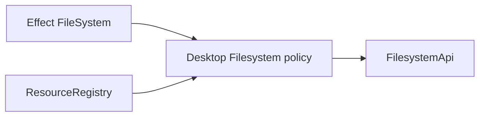

# Issue 1265: Rebase Filesystem on Effect FileSystem

## Problem

`packages/core/src/runtime/filesystem.ts` owned a custom `FilesystemAdapter` that mirrored filesystem operations already provided by Effect `FileSystem`. That made the desktop filesystem runtime responsible for both policy and basic platform I/O, and the test package had to maintain a second in-memory adapter DSL.

The root design should be:

Effect owns file I/O, stat, canonical paths, atomic temp writes, and watch streams. Effect Desktop owns only desktop-specific policy: schema validation, capability roots, symlink and hardlink escape protection, recursive delete policy, resource registry ownership, and host protocol error translation.

## Architecture

- Make `makeFilesystem` require `FileSystem.FileSystem`.
- Make `FilesystemLive` depend on `ResourceRegistry | FileSystem.FileSystem`.
- Delete `FilesystemAdapter`, `RawFilesystemEvent`, and `FilesystemWatcher` from the public core API.
- Delegate read, write, mkdir, remove, realpath, stat, rename, open/writeAll/sync, and watch to Effect `FileSystem`.
- Preserve desktop policy around permissions, canonicalization, symlink escapes, hardlink denial, recursive delete gating, watch owner scopes, and bridge error classes.
- Rebuild the test memory filesystem as an Effect `FileSystem` layer, not as a custom adapter.

## Verification

- Focused core filesystem tests cover bytes, atomic replacement, failure cleanup, stat identity, permissions, symlink/hardlink protections, recursive delete policy, and watch streams.
- Test package fixtures cover the memory filesystem through the same public `FilesystemApi`.
- API snapshots record the intentional breaking removal of the custom adapter exports.

## Architecture-Debt Sweep

Removed the filesystem adapter layer entirely. No follow-up issue is needed for this touched area because the former adapter and watch event DSL now use Effect `FileSystem` directly.

Other runtime adapters such as process, PTY, and worker remain outside this issue because they model platform process/lifecycle boundaries rather than plain Effect filesystem primitives.
