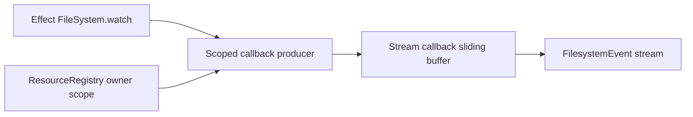

# Issue 1266: Model Filesystem Watches as Scoped Effect Streams

## Problem

`Filesystem.watch` already delegates platform events to Effect `FileSystem`, but it still owns a local stream runtime: an explicit queue, a service-owned fiber, and manual terminal signaling. That duplicates stream scope and backpressure mechanics that Effect already provides.

The root design should be:

Effect owns stream execution, buffering, interruption, and finalization. Effect Desktop owns only desktop-specific policy: path authorization, event schema validation, create/remove classification, owner-scope registration, and host protocol error mapping.

## Architecture

- Keep the public `watch(path, options): Stream<FilesystemEvent, FilesystemError>` API.
- Remove service-owned `Queue.sliding`, `Stream.fromQueue`, and `Effect.runFork` from `Filesystem.watch`.
- Convert `FileSystem.WatchEvent` values with a pure Effect helper that returns `FilesystemEvent`.
- Use `Stream.callback` for the callback queue so buffering belongs to the stream constructor and uses the requested watch buffer size.
- Run the upstream `FileSystem.watch` producer with `Effect.forkScoped`, not raw `Effect.runFork`.
- Let `ResourceRegistry.closeScope(ownerScope)` interrupt the upstream producer directly, so close is not blocked by a downstream consumer that is currently processing an event.

## Verification

- Focused filesystem tests cover event conversion, create/remove reclassification, invalid filenames, upstream watch errors, stream interruption cleanup, and owner-scope close cleanup.
- Static search shows no `Effect.runFork`, `Queue.sliding`, or manual `Stream.fromQueue` bridge remains in `packages/core/src/runtime/filesystem.ts`.
- Core typecheck proves the public stream contract remains `Stream<FilesystemEvent, FilesystemError, never>`.

## Architecture-Debt Sweep

Removed the remaining detached watch fiber and hand-built queue bridge over Effect streams. No follow-up issue is needed for this touched area because ordinary filesystem operations and watch streams now rely on Effect `FileSystem` and Effect `Stream` directly, while desktop-specific authorization and protocol policy remains in core.
